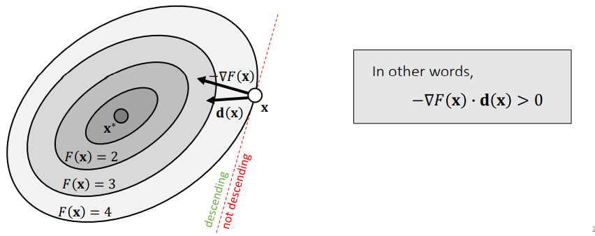
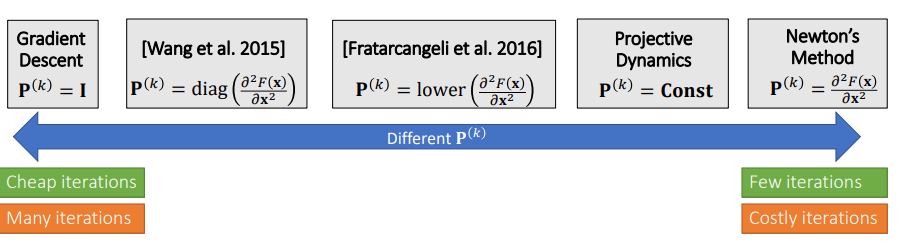
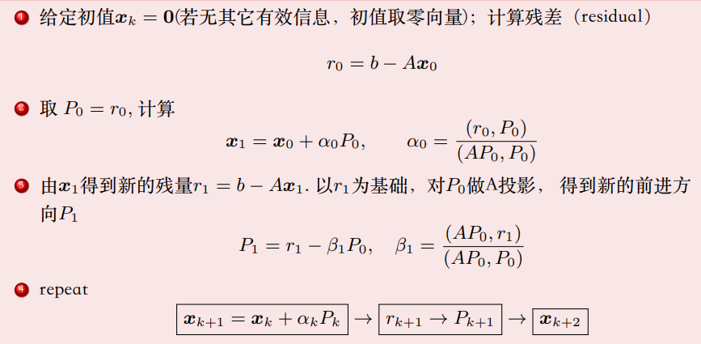

#! https://zhuanlan.zhihu.com/p/582266169
# 优化算法笔记

## 引入问题

**多元函数极值问题**
### 求解驻点 
已知 $A$ 对称正定, 求 $n$ 元二次函数 $f(x)$ 的极小值
$$
f(x)=\frac{1}{2} x^T A x-x^T b, \quad x \in \boldsymbol{R}^n
$$
>**$x$ 是自变量的向量**

多元函数极值的为**驻点**（一阶导数为零）, 先计算梯度(导数)
$$
\begin{aligned}
f(x)&=\frac{1}{2} \sum_{j=1}^n \sum_{k=1}^n a_{k j} x_k x_j-\sum_{j=1}^n x_j b_j \\
\frac{\partial f}{\partial x_l}&=\frac{1}{2} \sum_{k=1}^n a_{k l} x_k+\frac{1}{2} \sum_{j=1}^n a_{l j} x_j-b_l =\sum_{k=1}^n a_{k l} x_k-b_l \\
\nabla f &=\operatorname{grad} f=A x-b\\
\end{aligned}\\
$$
等价问题：
(1) $A \boldsymbol{x}-b=0$ 的解是多元函数驻点
$$
f(x)=\frac{1}{2} x^{\mathrm{T}} A x-x^{\mathrm{T}} b
$$
(2) 由于 $A$ 正定, 则二次函数 $f(x)$ 的极小值点 $x^*$ 必存在且为驻点。
$$
f\left(x^*\right)=\min f(x) \quad \Leftrightarrow \quad \nabla f\left(x^*\right)=A x^*-b=0
$$

### 求解目标：$f\left(x^*\right)=\min f(x) $
线性方程组 $A x=b$, 转化为多元函数的极小值问题, 那 如何找到这个极小值?
* 任给一点, 函数 $f(x)$ 在该点的负梯度方向下降最快!

具体步骤：
(1) 给定任意初值 $x_0$, (人当前所在位置), 计算残量 $r_0=b-A x_0$. (最陡的下降方向 $-\nabla f(x^*)$)
(2) 沿着选定的方向 $\mathrm{P}$ 前进, 例如 $P=r_0$ 方向 $x_1=x_0+\alpha * P, \quad$ 怎样选择合适的 $\alpha$ $\alpha=$ ? （沿着负梯度方向走多远?）当前方向P的最低点！满足
$$
\begin{gathered}
\left.\frac{d f}{d \alpha}\right|_{x_1}=\left.\nabla f\right|_{x=x_1} \cdot P=\left(r_1, P\right)=\left(b-A x_1, P\right)=0 \\
\rightarrow\left(b-A x_0-\alpha A P, P\right)=\left(r_0-\alpha A P, P\right)=0 \rightarrow \alpha=\frac{\left(r_0, P\right)}{(A P, P)}
\end{gathered}
$$
(3) repeat (环视一周, 找好新的前进方向, 走到底)

### 一. 梯度下降法
**如何找步长？**
### 精确法： Exact Line Search
$$
\alpha=\operatorname{argmin} F\left(\mathbf{x}^{(k)}-\alpha \nabla F\left(\mathbf{x}^{(k)}\right)\right) \\
$$

### 在保证往下降方向前行，且步长尽量大
#### Backtracking Line Search

Initialize $\alpha$
For $l=0 \ldots \infty$
Wolfe Conditions
If $F\left(\mathbf{x}^{(k)}-\alpha \nabla F\left(\mathbf{x}^{(k)}\right)\right)<F\left(\mathbf{x}^{(k)}\right)+\cdots$ 
then break
$\alpha \leftarrow \beta \alpha$

#### Descent Directions
如果存在足够小的步长 $\alpha$，则方向 $\mathbf{d}(\mathbf{x})$ 是下降的：
$$
F(\mathbf{x})>F(\mathbf{x}+\alpha \mathbf{d}(\mathbf{x}))\\
$$

##### 1.选择梯度的方向作为下降方向
$$
\mathbf{d}(\mathbf{x})=-\nabla F(\mathbf{x}) \Longrightarrow-\nabla F(\mathbf{x}) \cdot(-\nabla F(\mathbf{x}))>0
$$
##### 2. 牛顿法也是一种下降法，如果 Hessian 总是正定的：
$$
\mathbf{d}(\mathbf{x})=-\left(\frac{\partial^2 F(\mathbf{x})}{\partial \mathbf{x}^2}\right)^{-1} \nabla F(\mathbf{x}) \Rightarrow-\nabla F(\mathbf{x}) \cdot\left(-\left(\frac{\partial^2 F(\mathbf{x})}{\partial \mathbf{x}^2}\right)^{-1} \nabla F(\mathbf{x})\right)>0
$$
##### 3. 任何使用正定矩阵 $\mathbf{P}$ 来修改梯度的方法都会产生下降法：
$$
\mathbf{d}(\mathbf{x})=-\mathbf{P}^{-1} \nabla F(\mathbf{x}) \Rightarrow-\nabla F(\mathbf{x}) \cdot\left(-\mathbf{P}^{-1} \nabla F(\mathbf{x})\right)>0
$$

####  descent Methods总结：
所有的下降法可以归纳为如下形式：
Initialize $x^{(0)}$
For $k=0 \ldots K$
$$
\mathbf{x}^* \leftarrow \mathbf{x}^{(k+1)} \leftarrow \mathbf{x}^{(k)}-\alpha^{(k)}\left(\mathbf{P}^{(k)}\right)^{-1} \nabla F\left(\mathbf{x}^{(k)}\right)
$$
不同的  $\mathbf{P}$ 矩阵得到不同的求解方法。

### 二. 共轭梯度法

#### 前置条件
(1) 矩阵列满秩, 列向量可以选做一组基向量
$$
\operatorname{span}\left\{a_1, a_2, \ldots, a_n\right\}=\boldsymbol{R}^n
$$
(2) 解方程等价于：寻找一组坐标 $x_1, \ldots, x_n$ 使得 $b$ 可以由列向量线性表示！!
$$
b=x_1 * a_1+x_2 * a_2+\ldots+x_n * a_n
$$
若 $\mathrm{A}$ 是正交矩阵或者列向量 $a_k$ 彼此正交, 则容易计算出系数 $x_k$

##### $\bf b_k$ 在基向量下的投影即可求解 $\bf x_k$，有；
$$
x_k=\left(a_k, b\right), \quad k=1 \rightarrow n
$$

#### 共轭向量组
$A$ 对称正定, $u, v$ 是 $n$ 维向量, 则可定义 $A-$ 内积
$$
(u, v)_A=(A u, v)=v^T A u=\sum_{j=1}^n \sum_{k=1}^n a_{j k} u_j v_k\\
$$
若 $(v, u)_A=0$, 则该 $\mathrm{A}$ 内积对应的角度正交, 此时称为 $\mathrm{A}$ 共轭。简言之, A-共轭即是 $\mathrm{A}$ 内积下正交。
> **共轭即有线性无关。**

#### 利用共轭向量组的性质，直接求解。
给定 $\boldsymbol{R}^n$ 空间中一组彼此 $\mathrm{A}$ 共轭的向量组（可作为一组基)
$$
P_1, P_2, \cdots, P_n\\
$$
则目标向量 $x=A^{-1} b$ 可由表示成这组基的线性组合： $x=\sum_{j=1}^n \alpha_j P_j$
$$
\begin{aligned}
&A x=b=\sum_{j=1}^n \alpha_j A P_j \rightarrow P_k^T b=\alpha_k P_k^T A P_k\\
&\alpha_k=\frac{\left(P_k, b\right)}{\left(P_k, P_k\right)_A}=\frac{P_k^T b}{P_k^T A P_k}\\
\end{aligned}
$$
如果给定了一组共轭向量组 $P_k$, 则可按照上式求出对于系数 $\alpha_k$，即有精确解：
$$
\boldsymbol{x}=\sum_{j=0}^{n-1} \alpha_j P_j, \quad \alpha_k=\frac{P_k^{\mathrm{T}} b}{P_k^{\mathrm{T}} A P_k}\\
$$
理论上是直接法求精确解，实用上是迭代法近似解！一般 $k \ll n$, 也是子空间方法：
$$
\left\{\begin{array}{l}
x^{(0)}=\mathbf{0} \quad \text { Or other initial guess } \\
x^{(k+1)}=x^{(k)}+\alpha_k P_k=\alpha_0 P_0+\alpha_1 P_1+\ldots+\alpha_k P_k
\end{array}\right.
$$
>Note:
>* $\mathrm{P}$ 是比最速下降法的 $r_k$ 更有效的前进方向！！不必要 $k=n$, 精度满足要求即可。

#### 找出一组一组 $\mathrm{A}$ 共轭向量组 $P_k$

##### 施密特正交方法 Gram-Schmidt
$$
\left\{\begin{array}{l}
P_0=y_0 \\
P_j=y_j-\sum_{l=0}^{j-1} \frac{\left(A P_l, y_j\right)}{\left(A P_l, P_l\right)} P_l, \quad j \geq 1
\end{array}\right.\\
$$

#### 算法框架：
