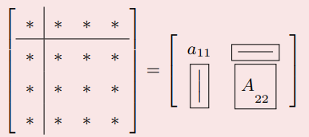

# 线性⽅程组数值解法
**学习目的：**
1. 直接法和迭代法的数学理论
2. 编程时，需要对对数组和矩阵运算的⽅便、⾼效性；尽量避免循环
3. 体会科学计算的核⼼：不要重复，多⽤并⾏！

## 1. 线性⽅程组直接法
解决的问题： 
$$
A x=b\\
$$

数学上有解析解： $x=A^{-1} b$。
但是实际使用计算机求解时候，一定要避免求逆过程（求逆过程计算量非常大）。

**假设问题唯一可解, 如何求解？**

(1) 如果系数矩阵A稠密且固定不变, 需要针对 1000 个不同的 右端项 $\mathrm{b}$, 反复求解上 式; 如何避免重复计算?
(2) 如果系数矩阵规模很大, 例如 10 万阶, 但是稀疏矩阵（绝大多数元素都是零), 如 何有效求解?

#### 解决办法
- 直接法: Gauss消去及其变形: LU分解, 列主元LU分解、Cholesky, ldl
- 迭代法: Jacobi, Gauss-Seidel, SOR

### 1.1 前置条件
$\mathbb{R}^{m \times n}$ 表示全体 $m \times n$ 实矩阵向量空间; $A \in \mathbb{R}^{m \times n}$ 等价于 （目前考虑m = n）
$$
A=\left(a_{i j}\right)=\left[\begin{array}{cccc}
a_{11} & a_{12} & \ldots & a_{1 n} \\
a_{21} & a_{22} & \ldots & a_{2 n} \\
\vdots & \vdots & \vdots & \vdots \\
a_{m 1} & a_{m 2} & \ldots & a_{m n}
\end{array}\right]
$$
$\vec{x} \in \mathbb{R}^n$ 等价于
$$
\vec{x}=\left(x_1, x_2, \cdots, x_n\right)^{\mathrm{T}}
$$

#### 矩阵的特征值和谱半径
设 $A \in \mathbb{R}^{n \times n}$, 若存在数 $\lambda$ 和非零向量 $\vec{x} \in \mathbb{R}^n$, 使得
$$
A \vec{x}=\lambda \vec{x}
$$
称 $\lambda$ 为 A的特征值, $\vec{x}$ 为对应特征值 $\lambda$ 的特征向量, $\mathrm{A}$ 的全体特征值称为 $\mathrm{A}$ 的谱, 记 作 $\sigma(A)=\left\{\lambda_1, \lambda_2, \ldots, \lambda_n\right\}$, 记
$$
\rho(A)=\max _{1 \leq i \leq n}\left|\lambda_i\right|
$$
为矩阵 $\mathrm{A}$ 的谱半径.

#### 特征多项
记 $\mathrm{I}$ 是恒同矩阵, 则方程
$$
(\lambda I-A) * \vec{x}=0
$$
有非零解; 进而
$$
\operatorname{det}(\lambda I-A)=0
$$
上式左端是关于末知量 $\lambda$ 的 $\mathrm{n}$ 次代数多项式, 称为 $\mathrm{A}$ 的特征多项式, 记为 $p(\lambda)$. 上式称为 $\mathrm{A}$ 的特征方程. 由代数知识, $p(\lambda)$ 在复数域有 $\mathrm{n}$ 个根 $\lambda_j$, 则
$$
p(\lambda)=\left(\lambda-\lambda_1\right)\left(\lambda-\lambda_2\right) \ldots\left(\lambda-\lambda_n\right)
$$
>Note:
>* 特征多项⽅法求矩阵的特征值和特征向量⽐较复杂,  因为涉及⾼次⽅程求根。

### 1.2 Gauss消去和LU分解
从计算⽅便的⾓度考虑：
(1) 对角阵: 
$$
\left\{\begin{array}{l}
2 x=4 \\
3 y=3
\end{array} \rightarrow\left[\begin{array}{ll|l}
2 & 0 & 4 \\
0 & 3 & 3
\end{array}\right]\right.\\
$$
(3) 三角形矩阵 ：
$$
\begin{array}{rr}
2 x+4 y-2 z=2 & 2 x+4 y-2 z=2 \\
4 x+9 y-3 z=8 & \rightarrow 1 y+1 z=4 \\
-2 x-3 y+7 z=10 &  4 z=8 \\
\end{array}\\
$$
>Note: 
> * Gauss消去的过程实际也是对矩阵进⾏三⾓形分解的过程

高斯消元相当于左乘初等矩阵; 例如
$$
E_{21}=\left[\begin{array}{cccc}
1 & 0 & \cdots & 0 \\
-l_{21} & 1 & \cdots & 0 \\
\vdots & \vdots & \ddots & \\
0 & 0 & \cdots & 1
\end{array}\right], \quad l_{21}=a_{21} / a_{11}
$$
依次记录消元因子 $l_{k j}$, 可得
$$
\underline{E_{n, n-1} * E_{n, n-2} E_{n-1, n-2} * \ldots * E_{n 1 \ldots} \ldots E_{31} E_{21}}  * A=U
$$
上式横线部分的逆即是 LU分解产生的下三角矩阵L. 即：$L^{-1}A = U$ 。
下三⾓L的元素即是Gauss消元过程中产⽣的乘⼦：
$$
L=\left[\begin{array}{cccc}
1 & 0 & 0 & 0 \\
l_{21} & 1 & 0 & 0 \\
l_{31} & l_{32} & 0 & 0 \\
l_{41} & l_{42} & l_{43} & 1
\end{array}\right]\\
$$
**LU分解的充分条件:**
矩阵正定和对角占优。
If $A$ is
- positive definite: $\quad x^{\mathrm{T}} A x>0 ; \forall x \in \mathbb{R}^n$
- diagonally dominate: $\left|a_{i i}\right|>\sum_{j=1}^n\left|a_{i j}\right|$

**运算步骤：**
* (1) 对n阶矩阵分块
* (2) 计算下三角矩阵 $L$ 的第一列元素
$$
L_{j 1}=\frac{A_{j 1}}{A_{11}} \quad j=2 \rightarrow n
$$
* (3) 更新A的剩余 $(n-1)$ 阶矩阵
$$
A_{\text {new }}=A_{22}-L(2: n, 1) * A(1,2: n)
$$
* (4) 矩阵更新为 $(n-1)$ 阶, 重复第一步, 直到 $\mathrm{n}=1$, 循环结束。

**Gauss消元的计算复杂度：** 得到三角形矩阵所需乘除法的次数:
$$
(n-1)^2+\ldots+1 = \frac{(n-1)n(2n-1)}{6} \approx \frac{1}{3} n^3 \\
$$
这是一个比较耗时的计算, **如需多次求解同一个系数矩阵产生的方程组（即b是由$b_1, b_2, b_k$多个向量组合的矩阵）, 应当先进行三 角形分解，避免每次重复消元。**
$$
A x=b \Leftrightarrow L(U x)=b \Leftrightarrow\left\{\begin{array}{r}
L y=b \\
U x=y
\end{array}\right.
$$
**除了第一步LU分解需要一次 $n^3$ 次计算量, 求解三角形方程组过程只要 $n^2$ 次计算量。**

Gauss 消去性能最好的条件: 带状矩阵: 三对角矩阵, d-diagonal matrix or d-banded matrix
$$
\left[\begin{array}{lllll}
2 & 1 & 0 & 0 & 0 \\
1 & 2 & 1 & 0 & 0 \\
0 & 1 & 2 & 1 & 0 \\
0 & 0 & 1 & 2 & 1 \\
0 & 0 & 0 & 1 & 2
\end{array}\right]
$$
对于带状矩阵, 计算复杂度是 $\mathbb{O}(n)$, 最优！!

### 1.3 消元法的衍生方法: 列主元高斯消去; 全主元高斯消去

#### 列主元Gauss消去
置换矩阵
$$
P=\left[\begin{array}{cccc}
1 & 0 & 0 & 0 \\
0 & 0 & 1 & 0 \\
0 & 1 & 0 & 0 \\
0 & 0 & 0 & 1
\end{array}\right], \quad P * P=I
$$
交换矩阵的两行相当于左乘置换阵！！
列主元高斯消去
* (1) 寻找当前列绝对值最大数（即：主元）, 判断是否交换行（左乘⼀个置换矩阵）
* (2) 换行后, 进行正常的消元

此过程写成矩阵形式如下
$$
\underline{E_{n, n-1} P_{n-1} * E_{n, n-2} E_{n-1, n-2} P_{n-2} * \ldots * E_{n 1} \ldots E_{31} E_{21} P_1 }  * A=U
$$
当 $n=4$ 时上式为:
$$
E_3 P_3 * E_2 P_2 * E_1 P_1 * A=U
$$
改写为(矩阵乘法满足结合律)
$$
E_3 *\left(P_3 E_2 P_3\right) *\left(P_3 P_2 E_1 P_2 P_3\right) *\left(P_3 P_2 P_1\right) * A=U
$$
进而
$$
F_3 F_2 F_1 P A=L^{-1} * P A=U
$$
**所以对于 $\mathrm{A}$ 为非奇异矩阵, 则存在置换矩阵 $\mathrm{P}$, 使得**
$$
P A=L U\\
$$

### 1.4 乔列斯基（cholesky）分解

####  对称正定矩阵
**重要矩阵：**  对称正定矩阵必可以进⾏三角形分解，且不需要换⾏。

* 设 $\mathrm{B}$ 是可逆矩阵 (或列满秩), 则 $A=B^T B$ 对称正定.
* Hint: 对称性显然满足。任给 $x \in \mathbb{R}^n$,
$$
x^T A x=x^T B^T B x=(B x)^T(B x) \geq 0
$$
且等号成立时, $B x=0 \rightarrow x=0$. 实际上, 只要B列向量线性无关, 即可。 

引入问题：给定对称正定矩阵A:
(1) 是否存在简单的 $\mathrm{B}$ (例如三角形矩阵)使之满足 $A=B^{\mathrm{T}} * B$ ?
(2) 如果存在, 如何找到? Cholesky分解

#### Cholesky分解
设 $A=L U$ 其中 $L$ 是单位下三角, $U$ 是普通上三角。提取上三角矩阵 $U$ 的对角元素组成对角阵, $U_0$ 是单位上三角矩阵; 如
$$
U=D * U_0\left[\begin{array}{ccc}
6 & 8 & 1 \\
0 & 2 & 1 \\
0 & 0 & 1
\end{array}\right]=\left[\begin{array}{ccc}
6 & 0 & 0 \\
0 & 2 & 0 \\
0 & 0 & 1
\end{array}\right]\left[\begin{array}{ccc}
1 & 4 / 3 & 1 / 6 \\
0 & 1 & 1 / 2 \\
0 & 0 & 1
\end{array}\right]
$$
若 $A$ 对称
$$
A=L U=L * D * U_0
$$
则
$$
L=U_0^{\mathrm{T}} \rightarrow A=L * D * L^{\mathrm{T}}
$$
Hint: 由对称性可得
$$
A=L U=A^{\mathrm{T}}=U_0^{\mathrm{T}} *\left(D * L^{\mathrm{T}}\right)=L_1 U_1
$$
其中 $L, L_1$ 都是单位下三角矩阵; 由分解的唯一性可知
$$
L U=L_1 U_1 \Leftrightarrow L^{-1} L U U_1^{-1}=L^{-1} L_1 U_1 U_1^{-1} \Leftrightarrow U U_1^{-1}=L^{-1} L_1
$$
则
$$
U U_1^{-1}=L^{-1} L_1=I \Rightarrow L=U_0^{\mathrm{T}}
$$
>Note:
>* 若A对称正定, 则D的对角元素⼤于零
>* $A=L D L^{\mathrm{T}}=(L \sqrt{D}) *\left(\sqrt{D} L^{\mathrm{T}}\right)=\tilde{L} * \tilde{L}^{\mathrm{T}}$

**求解过程：**
将 $A=L * L^{\mathrm{T}}$ 写成分块形式
$$
\left[\begin{array}{l|l}
a_{11} & A_{21}^{\mathrm{T}} \\
\hline A_{21} & A_{22}
\end{array}\right]=\left[\begin{array}{ll}
l_{11} & \\
L_{21} & L_{22}
\end{array}\right]\left[\begin{array}{ll}
l_{11} & L_{21}^{\mathrm{T}} \\
& L_{22}^{\mathrm{T}}
\end{array}\right]=\left[\begin{array}{cc}
l_{11}^2 & l_{11} L_{21}^{\mathrm{T}} \\
l_{11} L_{21} & L_{21} L_{21}^{\mathrm{T}}+L_{22} L_{22}^{\mathrm{T}}
\end{array}\right]
$$
- determine $l_{11}$ and $L_{21}$ :(一次开方, n-1次乘法)
$$
l_{11}=\sqrt{a_{11}}, \quad L_{21}=\frac{1}{l_{11}} A_{21}
$$
* compute $L_{22}$ from: $\left((n-1)^2\right.$ 次乘法,对称矩阵减半 $\left.(n-1)^2 / 2\right)$
$$
A_{22}-L_{21} * L_{21}^{\mathrm{T}}=L_{22} L_{22}^{\mathrm{T}}=A_{n e w}
$$
- $\mathrm{n}$ 阶矩阵变成了 $(\mathrm{n}-1)$ 阶矩阵 $\tilde{A}=\tilde{L} * \tilde{L}^{\mathrm{T}}$ 重复 1,2 , 过程。 n次上述点过程每次作用 $\frac{n^2}{2}$ 次乘法共计 $n^3 / 6$

**总结：**
* ⼀般地，没有规律的稠密矩阵可以进⾏LU分解，满足lu分解的矩阵A有对称性, 存储量可以减半；同时LU分解⼯作量也可以减半。
* Cholesky 分解同样适用于稀疏矩阵, 且一般情况下工作量大大降低。对有些问题通过行交换改变矩阵的pattern可以进一步的降低工作量。

### 1.5 平方根法

**只对称不正定：**
当矩阵为负定或者不定矩阵时, Cholesky分解不可直接使用。而改进的平方根法可用, 且与LU分解比较计算量同样减半。
$$
A=\left[\begin{array}{cccc}
1 & & & \\
l_{21} & 1 & & \\
\vdots & \vdots & \ddots & \\
l_{n 1} & l_{n 2} & \cdots & 1
\end{array}\right]\left[\begin{array}{llll}
d_1 & & & \\
& d_2 & & \\
& & \ddots & \\
& & & \\
& & & d_n
\end{array}\right]\left[\begin{array}{cccc}
1 & l_{21} & \cdots & l_{n 1} \\
& 1 & \cdots & l_{n 2} \\
& & \ddots & \vdots \\
& & & 1
\end{array}\right]
$$

#### 改进的平方根法
对矩阵进行分块：
$$
\left[\begin{array}{c|c}
a_{11} & A_{21}^{\mathrm{T}} \\
\hline A_{21} & A_{22}
\end{array}\right]=\left[\begin{array}{cc}
1 & \\
L_{21} & L_{22}
\end{array}\right]\left[\begin{array}{ll}
d_1 & \\
& D_2
\end{array}\right]\left[\begin{array}{cc}
1 & L_{21}^{\mathrm{T}} \\
& L_{22}^{\mathrm{T}}
\end{array}\right]
$$
(1) 算出 $d_1$, 进而 $L_{21}=A_{21} / d_1$
(2) 更新得到 $(n-1)$ 阶矩阵
$$
A_{n e w}=L_{22} * D_2 * L_{22}^{\mathrm{T}}=A_{22}-d_1 * L_{21} * L_{21}^{\mathrm{T}}
$$

### 1.5 三对角方程组的追赶法

#### 追赶法(Thomas Algorithm)
- 对于三对角矩阵(特殊的稀疏矩阵), Gauss消去 (LU分解) 最常用!

三对角或者 $d$ 对角线性方程组
$$
\left[\begin{array}{ccccc}
a_1 & c_1 & & & \\
b_2 & a_2 & c_2 & & \\
& \ddots & \ddots & \ddots & \\
& & b_{n-1} & a_{n-1} & c_{n-1} \\
& & & b_n & a_n
\end{array}\right]\left[\begin{array}{c}
x_1 \\
x_2 \\
\vdots \\
x_{n-1} \\
x_n
\end{array}\right]=\left[\begin{array}{c}
f_1 \\
f_2 \\
\vdots \\
f_{n-1} \\
f_n
\end{array}\right]
$$

#### 三对角矩阵的LU分解
LU分解保持带状矩阵的紧凑性。
* D-对角线性方程组不可进行行交换; 如果破坏这种紧凑性，运算量会从最低的 $\mathbb{O}(n)$ 急剧上升到 $\mathbb{O}\left(n^3\right)$;
$$
\left[\begin{array}{ccccc}
a_1 & c_1 & & & \\
b_2 & a_2 & c_2 & & \\
& \ddots & \ddots & \ddots & \\
& & b_{n-1} & a_{n-1} & c_{n-1} \\
& & & b_n & a_n
\end{array}\right]=\left[\begin{array}{ccccc}
1 & & & & \\
\alpha_1 & 1 & & & \\
& \ddots & \ddots & & \\
& & \alpha_{n-2} & 1 & \\
& & & \alpha_{n-1} & 1
\end{array}\right] *\left[\begin{array}{ccccc}
\beta_1 & c_1 & & & \\
& \beta_2 & c_2 & & \\
& & \ddots & \ddots & \\
& & & \beta_{n-1} & c_{n-1} \\
& & & & \beta_n
\end{array}\right]\\
$$
* 可以验算上述过程需要约 $2 \mathrm{n}$ 次乘除法, 一旦分解完成计算
$$
A x=f \Leftrightarrow L(U x)=f \Leftrightarrow\left\{\begin{array}{l}
L y=f \\
U x=y
\end{array}\right.
$$
* 求解上述方程只要约 3n次乘除法. 因此要是改变右端项, 反复求解上述方程, 也应当先进行分解。

### 1.6 矩阵的 $\mathrm{QR}$ 分解和解方程

**$\mathrm{QR}$ 分解:**
给定非奇异矩阵
$$
A=\left[\begin{array}{cccc}
\mid & \mid & \cdots & \mid \\
a_1 & a_2 & \cdots & a_n \\
\mid & \mid & \cdots & \mid
\end{array}\right]
$$
如何根据A 的列向量得到空间
$$
C(A)=\mathbb{R}^n=\operatorname{span}\left\{a_1, a_2, \ldots, a_n\right\}
$$

## 线性⽅程组迭代法
