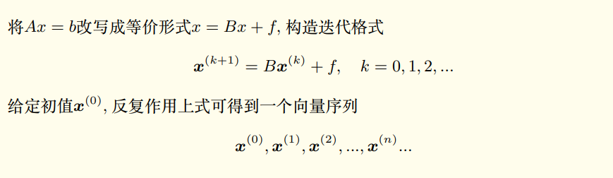

#! https://zhuanlan.zhihu.com/p/575784980
# 线性方程组数值解法
**学习目的：**
1. 直接法和迭代法的数学理论
2. 编程时，需要对对数组和矩阵运算的⽅便、⾼效性；尽量避免循环
3. 体会科学计算的核⼼：不要重复，多用并行。

## 一. 线性方程组直接法
解决的问题： 
$$
A x=b\\
$$

数学上有解析解： $x=A^{-1} b$。
但是实际使用计算机求解时候，一定要避免求逆过程（求逆过程计算量非常大）。

**假设问题唯一可解, 如何求解？**

(1) 如果系数矩阵A稠密且固定不变, 需要针对 1000 个不同的 右端项 $\mathrm{b}$, 反复求解上 式; 如何避免重复计算?
(2) 如果系数矩阵规模很大, 例如 10 万阶, 但是稀疏矩阵（绝大多数元素都是零), 如 何有效求解?

#### 解决办法
- 直接法: Gauss消去及其变形: LU分解, 列主元LU分解、Cholesky, ldl
- 迭代法: Jacobi, Gauss-Seidel, SOR

### 1.1 前置知识
$\mathbb{R}^{m \times n}$ 表示全体 $m \times n$ 实矩阵向量空间; $A \in \mathbb{R}^{m \times n}$ 等价于 （目前考虑m = n）
$$
A=\left(a_{i j}\right)=\left[\begin{array}{cccc}
a_{11} & a_{12} & \ldots & a_{1 n} \\
a_{21} & a_{22} & \ldots & a_{2 n} \\
\vdots & \vdots & \vdots & \vdots \\
a_{m 1} & a_{m 2} & \ldots & a_{m n}
\end{array}\right]
$$
$\vec{x} \in \mathbb{R}^n$ 等价于
$$
\vec{x}=\left(x_1, x_2, \cdots, x_n\right)^{\mathrm{T}}
$$

#### 矩阵的特征值和谱半径
设 $A \in \mathbb{R}^{n \times n}$, 若存在数 $\lambda$ 和非零向量 $\vec{x} \in \mathbb{R}^n$, 使得
$$
A \vec{x}=\lambda \vec{x}
$$
称 $\lambda$ 为 A的特征值, $\vec{x}$ 为对应特征值 $\lambda$ 的特征向量, $\mathrm{A}$ 的全体特征值称为 $\mathrm{A}$ 的谱, 记 作 $\sigma(A)=\left\{\lambda_1, \lambda_2, \ldots, \lambda_n\right\}$, 记
$$
\rho(A)=\max _{1 \leq i \leq n}\left|\lambda_i\right|
$$
为矩阵 $\mathrm{A}$ 的谱半径.

#### 特征多项
记 $\mathrm{I}$ 是恒同矩阵, 则方程
$$
(\lambda I-A) * \vec{x}=0
$$
有非零解; 进而
$$
\operatorname{det}(\lambda I-A)=0
$$
上式左端是关于末知量 $\lambda$ 的 $\mathrm{n}$ 次代数多项式, 称为 $\mathrm{A}$ 的特征多项式, 记为 $p(\lambda)$. 上式称为 $\mathrm{A}$ 的特征方程. 由代数知识, $p(\lambda)$ 在复数域有 $\mathrm{n}$ 个根 $\lambda_j$, 则
$$
p(\lambda)=\left(\lambda-\lambda_1\right)\left(\lambda-\lambda_2\right) \ldots\left(\lambda-\lambda_n\right)
$$
>Note:
>* 特征多项⽅法求矩阵的特征值和特征向量⽐较复杂,  因为涉及⾼次⽅程求根。

### 1.2 Gauss消去和LU分解
从计算⽅便的⾓度考虑：
(1) 对角阵: 
$$
\left\{\begin{array}{l}
2 x=4 \\
3 y=3
\end{array} \rightarrow\left[\begin{array}{ll|l}
2 & 0 & 4 \\
0 & 3 & 3
\end{array}\right]\right.\\
$$
(3) 三角形矩阵 ：
$$
\begin{array}{rr}
2 x+4 y-2 z=2 & 2 x+4 y-2 z=2 \\
4 x+9 y-3 z=8 & \rightarrow 1 y+1 z=4 \\
-2 x-3 y+7 z=10 &  4 z=8 \\
\end{array}\\
$$
>Note: 
> * Gauss消去的过程实际也是对矩阵进⾏三⾓形分解的过程

高斯消元相当于左乘初等矩阵; 例如
$$
E_{21}=\left[\begin{array}{cccc}
1 & 0 & \cdots & 0 \\
-l_{21} & 1 & \cdots & 0 \\
\vdots & \vdots & \ddots & \\
0 & 0 & \cdots & 1
\end{array}\right], \quad l_{21}=a_{21} / a_{11}
$$
依次记录消元因子 $l_{k j}$, 可得
$$
\underline{E_{n, n-1} * E_{n, n-2} E_{n-1, n-2} * \ldots * E_{n 1 \ldots} \ldots E_{31} E_{21}}  * A=U
$$
上式横线部分的逆即是 LU分解产生的下三角矩阵L. 即：$L^{-1}A = U$ 。
下三⾓L的元素即是Gauss消元过程中产⽣的乘⼦：
$$
L=\left[\begin{array}{cccc}
1 & 0 & 0 & 0 \\
l_{21} & 1 & 0 & 0 \\
l_{31} & l_{32} & 0 & 0 \\
l_{41} & l_{42} & l_{43} & 1
\end{array}\right]\\
$$
**LU分解的充分条件:**
矩阵正定和对角占优。
If $A$ is
- positive definite: $\quad x^{\mathrm{T}} A x>0 ; \forall x \in \mathbb{R}^n$
- diagonally dominate: $\left|a_{i i}\right|>\sum_{j=1}^n\left|a_{i j}\right|$

**运算步骤：**
* (1) 对n阶矩阵分块
* (2) 计算下三角矩阵 $L$ 的第一列元素
$$
L_{j 1}=\frac{A_{j 1}}{A_{11}} \quad j=2 \rightarrow n
$$
* (3) 更新A的剩余 $(n-1)$ 阶矩阵
$$
A_{\text {new }}=A_{22}-L(2: n, 1) * A(1,2: n)
$$
* (4) 矩阵更新为 $(n-1)$ 阶, 重复第一步, 直到 $\mathrm{n}=1$, 循环结束。

**Gauss消元的计算复杂度：** 得到三角形矩阵所需乘除法的次数:
$$
(n-1)^2+\ldots+1 = \frac{(n-1)n(2n-1)}{6} \approx \frac{1}{3} n^3 \\
$$
这是一个比较耗时的计算, **如需多次求解同一个系数矩阵产生的方程组（即b是由$b_1, b_2, b_k$多个向量组合的矩阵）, 应当先进行三 角形分解，避免每次重复消元。**
$$
A x=b \Leftrightarrow L(U x)=b \Leftrightarrow\left\{\begin{array}{r}
L y=b \\
U x=y
\end{array}\right.
$$
**除了第一步LU分解需要一次 $n^3$ 次计算量, 求解三角形方程组过程只要 $n^2$ 次计算量。**

Gauss 消去性能最好的条件: 带状矩阵: 三对角矩阵, d-diagonal matrix or d-banded matrix
$$
\left[\begin{array}{lllll}
2 & 1 & 0 & 0 & 0 \\
1 & 2 & 1 & 0 & 0 \\
0 & 1 & 2 & 1 & 0 \\
0 & 0 & 1 & 2 & 1 \\
0 & 0 & 0 & 1 & 2
\end{array}\right]
$$
对于带状矩阵, 计算复杂度是 $\mathbb{O}(n)$, 最优！!

### 1.3 消元法的衍生方法: 列主元高斯消去; 全主元高斯消去

#### 列主元Gauss消去
置换矩阵
$$
P=\left[\begin{array}{cccc}
1 & 0 & 0 & 0 \\
0 & 0 & 1 & 0 \\
0 & 1 & 0 & 0 \\
0 & 0 & 0 & 1
\end{array}\right], \quad P * P=I
$$
交换矩阵的两行相当于左乘置换阵！！
列主元高斯消去
* (1) 寻找当前列绝对值最大数（即：主元）, 判断是否交换行（左乘⼀个置换矩阵）
* (2) 换行后, 进行正常的消元

此过程写成矩阵形式如下
$$
\underline{E_{n, n-1} P_{n-1} * E_{n, n-2} E_{n-1, n-2} P_{n-2} * \ldots * E_{n 1} \ldots E_{31} E_{21} P_1 }  * A=U
$$
当 $n=4$ 时上式为:
$$
E_3 P_3 * E_2 P_2 * E_1 P_1 * A=U
$$
改写为(矩阵乘法满足结合律)
$$
E_3 *\left(P_3 E_2 P_3\right) *\left(P_3 P_2 E_1 P_2 P_3\right) *\left(P_3 P_2 P_1\right) * A=U
$$
进而
$$
F_3 F_2 F_1 P A=L^{-1} * P A=U
$$
**所以对于 $\mathrm{A}$ 为非奇异矩阵, 则存在置换矩阵 $\mathrm{P}$, 使得**
$$
P A=L U\\
$$

### 1.4 乔列斯基（cholesky）分解

####  对称正定矩阵
**重要矩阵：**  对称正定矩阵必可以进⾏三角形分解，且不需要换⾏。

* 设 $\mathrm{B}$ 是可逆矩阵 (或列满秩), 则 $A=B^T B$ 对称正定.
* Hint: 对称性显然满足。任给 $x \in \mathbb{R}^n$,
$$
x^T A x=x^T B^T B x=(B x)^T(B x) \geq 0
$$
且等号成立时, $B x=0 \rightarrow x=0$. 实际上, 只要B列向量线性无关, 即可。 

引入问题：给定对称正定矩阵A:
(1) 是否存在简单的 $\mathrm{B}$ (例如三角形矩阵)使之满足 $A=B^{\mathrm{T}} * B$ ?
(2) 如果存在, 如何找到? Cholesky分解

#### Cholesky分解
设 $A=L U$ 其中 $L$ 是单位下三角, $U$ 是普通上三角。提取上三角矩阵 $U$ 的对角元素组成对角阵, $U_0$ 是单位上三角矩阵; 如
$$
U=D * U_0\left[\begin{array}{ccc}
6 & 8 & 1 \\
0 & 2 & 1 \\
0 & 0 & 1
\end{array}\right]=\left[\begin{array}{ccc}
6 & 0 & 0 \\
0 & 2 & 0 \\
0 & 0 & 1
\end{array}\right]\left[\begin{array}{ccc}
1 & 4 / 3 & 1 / 6 \\
0 & 1 & 1 / 2 \\
0 & 0 & 1
\end{array}\right]
$$
若 $A$ 对称
$$
A=L U=L * D * U_0
$$
则
$$
L=U_0^{\mathrm{T}} \rightarrow A=L * D * L^{\mathrm{T}}
$$
Hint: 由对称性可得
$$
A=L U=A^{\mathrm{T}}=U_0^{\mathrm{T}} *\left(D * L^{\mathrm{T}}\right)=L_1 U_1
$$
其中 $L, L_1$ 都是单位下三角矩阵; 由分解的唯一性可知
$$
L U=L_1 U_1 \Leftrightarrow L^{-1} L U U_1^{-1}=L^{-1} L_1 U_1 U_1^{-1} \Leftrightarrow U U_1^{-1}=L^{-1} L_1
$$
则
$$
U U_1^{-1}=L^{-1} L_1=I \Rightarrow L=U_0^{\mathrm{T}}
$$
>Note:
>* 若A对称正定, 则D的对角元素⼤于零
>* $A=L D L^{\mathrm{T}}=(L \sqrt{D}) *\left(\sqrt{D} L^{\mathrm{T}}\right)=\tilde{L} * \tilde{L}^{\mathrm{T}}$

**求解过程：**
将 $A=L * L^{\mathrm{T}}$ 写成分块形式
$$
\left[\begin{array}{l|l}
a_{11} & A_{21}^{\mathrm{T}} \\
\hline A_{21} & A_{22}
\end{array}\right]=\left[\begin{array}{ll}
l_{11} & \\
L_{21} & L_{22}
\end{array}\right]\left[\begin{array}{ll}
l_{11} & L_{21}^{\mathrm{T}} \\
& L_{22}^{\mathrm{T}}
\end{array}\right]=\left[\begin{array}{cc}
l_{11}^2 & l_{11} L_{21}^{\mathrm{T}} \\
l_{11} L_{21} & L_{21} L_{21}^{\mathrm{T}}+L_{22} L_{22}^{\mathrm{T}}
\end{array}\right]
$$
- determine $l_{11}$ and $L_{21}$ :(一次开方, n-1次乘法)
$$
l_{11}=\sqrt{a_{11}}, \quad L_{21}=\frac{1}{l_{11}} A_{21}
$$
* compute $L_{22}$ from: $\left((n-1)^2\right.$ 次乘法,对称矩阵减半 $\left.(n-1)^2 / 2\right)$
$$
A_{22}-L_{21} * L_{21}^{\mathrm{T}}=L_{22} L_{22}^{\mathrm{T}}=A_{n e w}
$$
- $\mathrm{n}$ 阶矩阵变成了 $(\mathrm{n}-1)$ 阶矩阵 $\tilde{A}=\tilde{L} * \tilde{L}^{\mathrm{T}}$ 重复 1,2 , 过程。 n次上述点过程每次作用 $\frac{n^2}{2}$ 次乘法共计 $n^3 / 6$

**总结：**
* ⼀般地，没有规律的稠密矩阵可以进⾏LU分解，满足lu分解的矩阵A有对称性, 存储量可以减半；同时LU分解⼯作量也可以减半。
* Cholesky 分解同样适用于稀疏矩阵, 且一般情况下工作量大大降低。对有些问题通过行交换改变矩阵的pattern可以进一步的降低工作量。

### 1.5 平方根法

**只对称不正定：**
当矩阵为负定或者不定矩阵时, Cholesky分解不可直接使用。而改进的平方根法可用, 且与LU分解比较计算量同样减半。
$$
A=\left[\begin{array}{cccc}
1 & & & \\
l_{21} & 1 & & \\
\vdots & \vdots & \ddots & \\
l_{n 1} & l_{n 2} & \cdots & 1
\end{array}\right]\left[\begin{array}{llll}
d_1 & & & \\
& d_2 & & \\
& & \ddots & \\
& & & \\
& & & d_n
\end{array}\right]\left[\begin{array}{cccc}
1 & l_{21} & \cdots & l_{n 1} \\
& 1 & \cdots & l_{n 2} \\
& & \ddots & \vdots \\
& & & 1
\end{array}\right]
$$

#### 改进的平方根法
对矩阵进行分块：
$$
\left[\begin{array}{c|c}
a_{11} & A_{21}^{\mathrm{T}} \\
\hline A_{21} & A_{22}
\end{array}\right]=\left[\begin{array}{cc}
1 & \\
L_{21} & L_{22}
\end{array}\right]\left[\begin{array}{ll}
d_1 & \\
& D_2
\end{array}\right]\left[\begin{array}{cc}
1 & L_{21}^{\mathrm{T}} \\
& L_{22}^{\mathrm{T}}
\end{array}\right]
$$
(1) 算出 $d_1$, 进而 $L_{21}=A_{21} / d_1$
(2) 更新得到 $(n-1)$ 阶矩阵
$$
A_{n e w}=L_{22} * D_2 * L_{22}^{\mathrm{T}}=A_{22}-d_1 * L_{21} * L_{21}^{\mathrm{T}}
$$

### 1.6 三对角方程组的追赶法

#### 追赶法(Thomas Algorithm)
- 对于三对角矩阵(特殊的稀疏矩阵), Gauss消去 (LU分解) 最常用!

三对角或者 $d$ 对角线性方程组
$$
\left[\begin{array}{ccccc}
a_1 & c_1 & & & \\
b_2 & a_2 & c_2 & & \\
& \ddots & \ddots & \ddots & \\
& & b_{n-1} & a_{n-1} & c_{n-1} \\
& & & b_n & a_n
\end{array}\right]\left[\begin{array}{c}
x_1 \\
x_2 \\
\vdots \\
x_{n-1} \\
x_n
\end{array}\right]=\left[\begin{array}{c}
f_1 \\
f_2 \\
\vdots \\
f_{n-1} \\
f_n
\end{array}\right]
$$

#### 三对角矩阵的LU分解
LU分解保持带状矩阵的紧凑性。
* D-对角线性方程组不可进行行交换; 如果破坏这种紧凑性，运算量会从最低的 $\mathbb{O}(n)$ 急剧上升到 $\mathbb{O}\left(n^3\right)$;
$$
\left[\begin{array}{ccccc}
a_1 & c_1 & & & \\
b_2 & a_2 & c_2 & & \\
& \ddots & \ddots & \ddots & \\
& & b_{n-1} & a_{n-1} & c_{n-1} \\
& & & b_n & a_n
\end{array}\right]=\left[\begin{array}{ccccc}
1 & & & & \\
\alpha_1 & 1 & & & \\
& \ddots & \ddots & & \\
& & \alpha_{n-2} & 1 & \\
& & & \alpha_{n-1} & 1
\end{array}\right] *\left[\begin{array}{ccccc}
\beta_1 & c_1 & & & \\
& \beta_2 & c_2 & & \\
& & \ddots & \ddots & \\
& & & \beta_{n-1} & c_{n-1} \\
& & & & \beta_n
\end{array}\right]\\
$$
* 可以验算上述过程需要约 $2 \mathrm{n}$ 次乘除法, 一旦分解完成计算
$$
A x=f \Leftrightarrow L(U x)=f \Leftrightarrow\left\{\begin{array}{l}
L y=f \\
U x=y
\end{array}\right.
$$
* 求解上述方程只要约 3n次乘除法. 因此要是改变右端项, 反复求解上述方程, 也应当先进行分解。

### 1.7 矩阵的 $\mathrm{QR}$ 分解和解方程

**$\mathrm{QR}$ 分解:**
给定非奇异矩阵
$$
A=\left[\begin{array}{cccc}
\mid & \mid & \cdots & \mid \\
a_1 & a_2 & \cdots & a_n \\
\mid & \mid & \cdots & \mid
\end{array}\right]
$$
使用Gram-Schmidt正交化，将A 的列向量得到空间 $C(A)$ 的⼀组标准正交基
$$
C(A)=\mathbb{R}^n=\operatorname{span}\left\{a_1, a_2, \ldots, a_n\right\}
$$

**Gram-Schmidt正交化**
具体过程：
$$
A=\left[\begin{array}{cccc}
\mid & \mid & \cdots & \mid \\
a_1 & a_2 & \cdots & a_n \\
\mid & \mid & \cdots & \mid
\end{array}\right] \rightarrow Q=\left[\begin{array}{cccc}
\mid & \mid & \cdots & \mid \\
q_1 & q_2 & \cdots & q_n \\
\mid & \cdots & \mid
\end{array}\right]
$$
方法:
$$
q_k=a_k-P_{\text {proj }}\left(\operatorname{span}\left\{a_1, a_2, \ldots, a_{k-1}\right\}=\operatorname{span}\left\{q_1, q_2, \ldots, q_{k-1}\right\}\right) \\
$$
$A \rightarrow Q$ 的过程中, 做了哪些事? 能否用矩阵形式表示?
对列做投影(某种列变换)
$$
A B=Q \rightarrow A=Q K
$$
Gram-Schmidt正交化⽅法本质上是将A分解为:
$$
A=Q R, \quad \& \quad Q^{\mathrm{T}} Q=I\\
$$
根据正交化过程可以得到Q，由Q是正交矩阵的性质可以得到：
$$
R=Q^{\mathrm{T}} A \\
$$
**R是上三角矩阵**

>Note: 直接按照投影⽅法计算QR，数值⽅法极其不稳定。 可以采用特征值计算时将引⼊正交
变换法（Householder）完成QR分解来完成对QR分解的优化。

一旦完成 $Q R$ 分解, 求解可按照如下步骤进行
$$
A x=Q R x=b \rightarrow\left\{\begin{array}{l}
y=Q^T b \\
R x=y
\end{array}\right.
$$
此处计算量理论值大 $n^2+\frac{n^2}{2}$; 但是实际计算比LU分解可能更快。
* 因为矩阵和向量运算部分可以并行计算。

## 二. 线性方程组迭代法
前面已经分析了使用直接法求解方程 $A x=b$ 的情况，接下来分析使用迭代法求解方程组的情况。 
* A进行三角分解之后 $A=L U$, 解方程的工作量是 $O\left(n^2\right)$.
* 迭代法的目标是降低计算复杂度到 $\boldsymbol{O}(n)$.
* 迭代法适用于大型稀疏矩阵, 迭代一次的工作量与矩阵的稀疏程度有关
  * 偏微分方程的差分方法和有限元方法产生的代数方程, 其系数矩阵都是稀疏的; 例如椭圆算子的标准五点差分格式, 系数矩阵的每行只有 5 个非零元素, 迭代一次需要 $5 \mathrm{n}$ 次乘 法。若 $n$ 很大且迭代收玫较快时, 迭代法的运算量只有 $\mathrm{O}(n)$

**迭代法与直接法的区别：**
记 $x^*$ 是 $A x=b$ 的精确解。
(0) 直接法的目标是找到 $x^*$ 本身
(1) 迭代法的目标是找到 $x^*$ 的有效近似解, 例如
$$
\left\|x-x^*\right\|<\tau=10^{-6}
$$
则 $x$ 即是所求。只要满足容许的误差 $\tau$ 即可
如何得到近似解 $x$ ? 从方程组出发构造迭代格式, 迭代格式产生向量序列 $x^k$, 向量序列收敛即可.
$$
\boldsymbol{x}^{(0)}, x^{(1)}, \ldots, x^{(k)}, \ldots
$$

### 2.1 范数
更多知识可参考：《泛函分析》
#### 向量范数
设 $x \in \boldsymbol{R}^n$, 内积空间诱导范数一般称之为 2 范数。更一般的, 可以定义p范数
$$
\boldsymbol{x}=\left(x_1, x_2, \ldots, x_n\right)^{\mathrm{T}} ; \quad\|\boldsymbol{x}\|_p=\left(\sum_{j=1}^n\left|x_j\right|^p\right)^{\frac{1}{p}}, 1 \leq p<+\infty
$$
- 1-范数, $p=1$,
$$
\|\boldsymbol{x}\|_1=\sum_{j=1}^n\left|x_j\right|
$$
- 2-范数, $\mathrm{p}=2$,
$$
\|\boldsymbol{x}\|_2=\left(\sum_{j=1}^n\left|x_j\right|^2\right)^{\frac{1}{2}}
$$
- $\infty$-范数, $p \rightarrow \infty$
$$
\|\boldsymbol{x}\|_{\infty}=\lim _{p \rightarrow \infty}\|\boldsymbol{x}\|_p=\lim _{p \rightarrow \infty}\left(\sum_{j=1}^n\left|x_j\right|^p\right)^{\frac{1}{p}}=\max _{1 \leq j \leq n}\left|x_j\right|
$$

**范数定义：**

符号 $\|\cdot\|$ 可以看作是一个映射, 值域是 $[0,+\infty)$, 满足
* (1) 正定性 $\|x\| \geq 0$ 且 等号成立当且紧当 $x$ 是零元
* (2) 齐次性 $\|\alpha x\|=|\alpha| \cdot\|x\|, \forall \alpha \in \mathrm{C}$
* (3) 三角形不等式 $\|\boldsymbol{x}+\boldsymbol{y}\| \leq\|\boldsymbol{x}\|+\|\boldsymbol{y}\|$
>Tips: 范数用来衡量一个向量的大小, 长度, 类似于实数或复数的绝对值; 运算结果是 一个非负数.

**范数性质：**
从映射的角度看, $\mathrm{n}$ 维向量的范数又是一个 $\mathrm{n}$ 元函数; 可以证明该函数(此时称之为范数) 对每一个自变量(此时称之为向量的分量)均是连续的. 即
$$
\left\|\left[\begin{array}{c}
\mid \\
x_k+\varepsilon \\
\mid
\end{array}\right]-\left[\begin{array}{c}
\mid \\
x_k \\
\mid
\end{array}\right]\right\| \rightarrow 0 \text { as } \varepsilon \rightarrow 0
$$
**证明⼀个向量序列收敛，则只需要在其中⼀个范数下证明收敛即可**

#### 向量序列的收敛
设 $\left\{\boldsymbol{x}^{(k)}\right\}$ 是 $\boldsymbol{R}^n$ 中的向量序列, $\boldsymbol{x}^* \in \boldsymbol{R}^n$, 若对每一个向量分量, 都有
$$
\lim _{k \rightarrow \infty} x_j^{(k)}=x_j^*, \quad 1 \leq j \leq n
$$
则称序列 $\boldsymbol{x}^{(k)}$ 收敛到 $\boldsymbol{x}^*$, 记为
$$
\lim _{k \rightarrow \infty} x^{(k)}=\boldsymbol{x}^*
$$

$\boldsymbol{R}^n$ 中序列收敛等价于以任何一种范数收敛
$$
\lim _{k \rightarrow \infty} x^{(k)}=\boldsymbol{x}^* \Leftrightarrow \lim _{k \rightarrow \infty}\left\|\boldsymbol{x}^{(k)}-\boldsymbol{x}^*\right\|=0
$$
Tips: 判断向量序列的收敛性可用数列(误差序列范数)是否趋于零考量！！

#### 矩阵范数
需求:
在误差分析中, 矩阵范数大多时候与向量范数会同时出现, 因此希望二者之间有一定的 联系和统一性。例如：F范数符合范数定义, 但不好用！！
**Definition:**
任给一个向量 $x \in \boldsymbol{R}^n$, 矩阵 $A \in \boldsymbol{R}^{n \times n}$, 以及范数 $\|x\|_\diamond$, (如: $\diamond =1,2, \infty$ ), 可以按照如下 方式定义一个从属于内范数的关于矩阵 $\mathrm{A}$ 的算子范数
$$
\|A\|_{\diamond}=\max _{x \neq \overrightarrow{0}} \frac{\|A x\|_{\diamond}}{\|x\|_{\diamond}}\\
$$
矩阵范数满足范数的定义, 同时还具有如下性质
$$
\|A B\| \leq\|A\| \cdot\|B\| ; \quad\|A x\| \leq\|A\| \cdot\|x\|
$$
常用的三种范数 公式
- $\|A\|_{\infty}=\max _{1 \leq i \leq n} \sum_{j=1}^n\left|a_{i j}\right|$
- $\|A\|_1=\max _{1 \leq j \leq n} \sum_{i=1}^n\left|a_{i j}\right|$
- $\|A\|_2=\sqrt{\lambda_{\max }\left(A^{\mathrm{T}} * A\right)} \quad \lambda_{\max }$ 指最大特征值
  
>Note: 
>* 向量的范数，就是表示这个原有集合的大小。
>* 矩阵的范数，就是表示这个变化过程的大小的一个度量。

#### 矩阵的特征值和谱半径
设 $A=\left(a_{i j}\right) \in \boldsymbol{R}^{n \times n}$, 若存在 $\lambda \in \boldsymbol{C}$ 和非零向量 $\boldsymbol{x}=\left(x_1, x_2, \ldots, x_n\right) \in \boldsymbol{R}^n$, 使得
$$
A x=\lambda x
$$
则称 $\lambda$ 为 $\mathrm{A}$ 的特征值, $\mathrm{x}$ 为特征向量, $\mathrm{A}$ 的全体特征值称为 $\mathrm{A}$ 的谱, 记 $\rho(A)=\max _{1 \leq j \leq n}\left|\lambda_j\right|$ 为 $A$ 的谱半径。

**最常用的2范数：**
$$
\|A\|_2=\sqrt{\lambda_{\max }\left(A^{\mathrm{T}} * A\right)} \quad \lambda_{\max } \text { 指最大特征值 }
$$
**对称矩阵的 2 范数就是其最大(绝对值)特征值：谱半径**
注意到 $A * A^{\mathrm{T}}$ 与 $A^{\mathrm{T}} * A$ 有相同的特征值
- 矩阵的 2 范数即是最大奇异值singular value 
- 矩阵 $A$ 与其转置 $A^{\mathrm{T}}$ 有相同的 2 范数
- 对称矩阵的奇异值就是特征值

两个结论:
- 对任意一个矩阵算子范数, 有
$$
\rho(A) \leq\|A\|
$$
当 $\mathrm{A}$ 是对称矩阵且取 2 范数时, 等号成立。
- $\forall \epsilon>0$, 存在一个矩阵算子范数 $\|\cdot\|_{\bullet}$, 使得
$$
\|A\|_{\diamond} \leq \rho(A)+\epsilon
$$

⼀句话：数值上，谱半径可认为是算⼦范数。

#### 矩阵条件数
计算目标
$$
\left[\begin{array}{cc}
1 & 1 \\
1 & 1.0001
\end{array}\right]\left[\begin{array}{l}
x_1 \\
x_2
\end{array}\right]=\left[\begin{array}{l}
2 \\
2
\end{array}\right] \rightarrow\left[\begin{array}{l}
x_1 \\
x_2
\end{array}\right]=\left[\begin{array}{l}
2 \\
0
\end{array}\right]
$$
实际计算时右端项存在小的扰动误差, 例如
$$
\left[\begin{array}{cc}
1 & 1 \\
1 & 1.0001
\end{array}\right]\left[\begin{array}{l}
x_1 \\
x_2
\end{array}\right]=\left[\begin{array}{c}
2 \\
2.0001
\end{array}\right] \rightarrow\left[\begin{array}{l}
x_1 \\
x_2
\end{array}\right]=\left[\begin{array}{l}
1 \\
1
\end{array}\right]
$$
万分之一的右端项扰动得到百分之百的误差? WHY?
右端项有一微小的扰动, 所得结果千差万别。这种现象称之为“病态”; 如下矩阵称为**病态**(ill-condition)矩阵
$$
A=\left[\begin{array}{cc}
1 & 1 \\
1 & 1.0001
\end{array}\right]
$$
**右端项扰动传递给解：**

考虑 $A x=b$; 如果右端项有微小扰动 $\underline{\delta b}$, 则实际求解问题,可得如下关系：
$$
\frac{\|\delta x\|}{\|x\|} \leq \underline{\|A\| *\left\|A^{-1}\right\|} \frac{\|\delta b\|}{\|b\|}\\
$$
**条件数：** 右端项扰动所带来的解的扰动完全体现于条件数，不同的范数对应不同的条件数。
$$
\operatorname{cond}(A)=\left\|A^{-1}\right\| *\|A\| \\
$$
* 矩阵 $A$ 的条件数唯一决定了线性方程 的解 $x$ 受观测值 $b$ 的噪声的影响程度，条件数越大， $x$ 受噪声影响越严重，这意味看， $x$ 的变化 率越偏离 $b$ 的变化率 (即 $x$ 变化很大而 $b$ 变化很小或者反之) 。
* 注：条件数对稳定性的衡量不受尺度影 响，整体放缩任意的比例都不会影响该不等式的结果，因为受噪声影响程度是通过变化率来衡量 的，与绝对大小无关。

**条件数性质：**
- 任意条件数均大于 1
$$
\operatorname{cond}(\mathrm{A})=\left\|\mathrm{A}^{-1}\right\| *\|\mathrm{~A}\| \geq\left\|\mathrm{A}^{-1} \mathrm{~A}\right\|=1
$$
- 任意常数 $c \neq 0$
$$
\operatorname{cond}(\mathrm{cA})=\operatorname{cond}(\mathrm{A})
$$
>Note: 条件数几何意义：
>* 条件数同时描述了矩阵 $A$ 对向量的拉伸能力和压缩能力，即令向量发生形变的能力。条件数越大，向量在变换后越可能变化得越多

**常用的条件：**
- 无穷条件数 $\operatorname{cond}(\mathrm{A})_{\infty}=\left\|\mathrm{A}^{-1}\right\|_{\infty} *\|\mathrm{~A}\|_{\infty}$
- 谱(2)条件数(最大和最小奇异值比值)
$$
\operatorname{cond}(\mathrm{A})_2=\left\|\mathrm{A}^{-1}\right\|_2 *\|\mathrm{~A}\|_2=\sqrt{\frac{\lambda_{\max }\left(\mathrm{A}^{\mathrm{T}} \mathrm{A}\right)}{\lambda_{\min }\left(\mathrm{A}^{\mathrm{T}} \mathrm{A}\right)}}=\frac{\left|\sigma_1\right|}{\left|\sigma_{\mathrm{n}}\right|}
$$
当 $A$ 为对称矩阵时, 奇异值即是特征值
$$
\operatorname{cond}(\mathrm{A})_2=\frac{\left|\lambda_1\right|}{\left|\lambda_{\mathrm{n}}\right|}
$$
- 当 $R$ 为正交矩阵时,
$$
\operatorname{cond}(\mathrm{R})_2=1 ; \quad \operatorname{cond}(\mathrm{RA})_2=\operatorname{cond}(\mathrm{AR})_2=\operatorname{cond}(\mathrm{A})_2
$$
但是再实际求解过程中： 条件数计算困难
- 矩阵 $\Lambda$ 的特征值, 奇异值的计算难度 远远远大丁解 $A x=b$
- 汏际计算时, 除非特别必要, 一般不计算条件数！！
- 仅仅为了解方程, 又想知道条件数大小, 可以依靠经验值：
  - 当矩阵的行列式绝对值接近0的时候，A的条件数可能很⼤； 或者A的元素间数量级相差很⼤，且⽆规则，A可能病态。

#### 条件数与预处理
给定 $\mathrm{A}$ 矩阵, 如果需要多次解方程, 对精度要求高, 且有计划做预处理, 可以按照如下 步骤估计其条件数
(1) 给一个随机列向量 $y$, 并计算 $b=A * y$
(2) 求解 $A x=b$, 得到 $x$, 看 $x-y$ 的大小
注意上述过程需要解一次方程, 如果目标仅仅是为了解一次方程而且对精度要求不高, 上述过程无意义。

**矩阵预处理:**
$$
A x=b \Leftrightarrow P A x=P b, \& \operatorname{cond}(P A) \ll \operatorname{cond}(A)
$$
* P要足够简单且容易得到！理论上最好的 $\mathrm{P}, P A=I$, 实际上不可取, 因为不能求逆。
* P可以由取A的对角元素取出来构成一个对角阵，然后取逆。

### 2.2 迭代法⼀般原理

**定义：** 对上述产生的向量序列, 若
$$
\lim _{k \rightarrow \infty} x^{(k)}=x^*
$$
则称迭代法收敛, 且 $\boldsymbol{x}^*$ 即是方程组的解, 否则称为发散。

#### 迭代格式收敛条件
记 $x^*$ 是精确解, 引进误差向量
$$
\boldsymbol{\varepsilon}^{(k)}=\boldsymbol{x}^{(k)}-\boldsymbol{x}^* \\
$$
可知迭代序列是否收敛等价于： $\lim _{k \rightarrow \infty} \varepsilon^{(k)}=\overrightarrow{0}$。
注意到 $x^*$ 满足： $\boldsymbol{x}^*=B * \boldsymbol{x}^*+f$。
上式与迭代格式：
$$
\boldsymbol{x}^{(k+1)}=B * \boldsymbol{x}^{(k)}+f \\
$$
**收敛条件：** 对应相减, 即得
$$
\varepsilon^{(k+1)}=B \varepsilon^{(k)}=\ldots=B^{k+1} \varepsilon^{(0)} \\
$$
观察上式, $\varepsilon^{(0)}$ 是初始误差, 一般不为零; $\varepsilon^{(k+1)}$ 是否收敛于 0 向量, 完全取决于迭代矩阵 $B$。
$$
\lim _{k \rightarrow \infty}\left\|\varepsilon^{(k+1)}\right\|=\lim _{k \rightarrow \infty}\left\|B^{k+1} \varepsilon^{(0)}\right\|=0
$$
分析：$\left\|B^{k+1} \varepsilon^{(0)}\right\| \leq\left\|B^{k+1}\right\| *\left\|\varepsilon^{(0)}\right\| \leq\|B\|^{k+1} *\left\|\varepsilon^{(0)}\right\|$
>Note:
>* 若存在某种矩阵范数使得 $\|B\|<1$, 则迭代收敛.
>* 存在不代表一定找得到

**如何寻找收敛条件？**
利用矩阵范数和谱半径之间的关系
- 对任意矩阵算子范数
$$
\rho(B) \leq\|B\|
$$
- $\forall \epsilon>0$, 存在一个矩阵算子范数 $\|\cdot\|_{\diamond}$, 使得
$$
\|B\|_{\diamond} \leq \rho(B)+\epsilon
$$

>Note:
>* 数值上看, 最小的矩阵算子范数就是谱半径！！因而迭代是否收玫取决于迭代矩阵的谱 半径是否小于1。

#### 误差估计
如果找到某种范数满足 $\|B\|_{\diamond}=q<1$, 则由迭代格式： $\varepsilon^{(k+1)}=B * \varepsilon^{(k)}$
将等式 $\boldsymbol{\varepsilon}^{(k)}=\boldsymbol{x}^{(k)}-\boldsymbol{x}^*$ 带入，即有：
$$
\left\|\boldsymbol{x}^{(k+1)}-\boldsymbol{x}^{(k)}\right\|=\left\|\boldsymbol{\varepsilon}^{(k+1)}-\boldsymbol{\varepsilon}^{(k)}\right\| \geq(1-q) *\left\|\varepsilon^{(k)}\right\|
$$

如果存在迭代矩阵的某种范数满足 $\|B\|=q<1$, 则有如下估计
- 先验估计 $\left\|x^*-x^{(k)}\right\| \leq q^k\left\|x^*-x^{(0)}\right\|$
- 后验估计(第一个小于号) $\left\|x^*-x^{(k)}\right\| \leq \frac{q}{1-q}\left\|x^{(k)}-x^{(k-1)}\right\| \leq \frac{q^k}{1-q} \| x^{(1)}-x^{(0)} \|$

**残差：** 因为谱半径（就是$q$）是最大的特征值，求解特征值计算量大于求解方程。所以**实际工程中更多的是使用残差、(残量、residual）来判断数值解的精度。**
$$
r_k=b-A x^{(k)}=A x^*-A x^{(k)}=A *\left(x^*-x^{(k)}\right)=A * \varepsilon^{(k)}\\
$$

### 2.3 Jacobi迭代

#### 迭代格式的构造原则
给定 $\mathrm{Ax}=\mathrm{b}$, 选取迭代矩阵 $\mathrm{B}$, 以满足收敛性条件。
$$
A x-b=0 \Leftrightarrow x=x-C *(A x-b)
$$
得到迭代格式
$$
x^{(k+1)}=(I-C A) x^{(k)}+C b, \quad k=0,1,2, \ldots \\
$$
观察上式, 迭代矩阵即为 $B=I-C A$, 由前文收敛性分析可知。
* 若存在某种范数使得 $\|I-C A\|=q<1$, 则迭代格式收敛性. 此时也可称 $\mathrm{C}$ 为 $\mathrm{A}$ 的广义逆矩阵. $\mathrm{q}=0$ 时, 有 $C A=I$
* 理论上C取A的逆是计算最快的，但是实际上应用上求逆的过程计算复杂度远大于求解方程组。

#### Jacobi迭代
**考虑特殊情况**：$\mathrm{A}$ 的对角线元素数量级比该行其它元素都大（对角占优）. 形式上 $A \approx D=\operatorname{diag}(A)$, 即
$$
A=\left[\begin{array}{cccc}
a_{11} & a_{12} & \ldots & a_{1 n} \\
a_{21} & a_{22} & \ldots & a_{2 n} \\
\vdots & \vdots & \ddots & \vdots \\
a_{n 1} & a_{n 2} & \ldots & a_{n n}
\end{array}\right] \approx\left[\begin{array}{cccc}
a_{11} & 0 & \ldots & 0 \\
0 & a_{22} & \ldots & 0 \\
\vdots & \vdots & \ddots & \vdots \\
0 & 0 & \ldots & a_{n n}
\end{array}\right]=D
$$
则 $C=D^{-1}$, 进而迭代矩阵， 此时构造迭代格式, 称之为Jacobi迭代。
$$
B=I-C A=I-D^{-1} * A
$$

**一般化：**
将系数矩阵写成如下形式 $A=D+L+U$
$$
A=\left[\begin{array}{cccc}
a_{11} & 0 & \cdots & 0 \\
0 & a_{22} & \ddots & \vdots \\
\vdots & \ddots & \ddots & 0 \\
0 & \cdots & 0 & a_{n n}
\end{array}\right]+\left[\begin{array}{cccc}
0 & 0 & \cdots & 0 \\
a_{21} & 0 & \ddots & \vdots \\
\vdots & \ddots & \ddots & 0 \\
a_{n 1} & \cdots & a_{n n-1} & 0
\end{array}\right]+\left[\begin{array}{cccc}
0 & a_{12} & \cdots & a_{1 n} \\
0 & 0 & \ddots & \vdots \\
\vdots & \ddots & \ddots & a_{n-1 n} \\
0 & \cdots & 0 & 0
\end{array}\right]\\
$$
其中 $\mathrm{D}$ 是对角矩阵, $\mathrm{L}$ 是下三角部分, $\mathrm{U}$ 是上三角部分. 则
$$
B=D^{-1} * D-D^{-1} *(D+L+U)=-D^{-1} *(L+U)\\
$$
于是Jacobi迭代格式 $x=\underset{\sim}{B} x+\underline{\underline{f}}$ 为
$$
x^{(k+1)}=-D^{-1}(L+U) * x^{(k)}+\underline{D^{-1} b}\\
$$
或者(计算时用) 求解对角方程：
$$
D x^{(k+1)}=\left(b-(L+U) * x^{(k)}\right)\\
$$
**Jacobi迭代的求和表⽰:**
矩阵形式简洁, 求和形式如下:
$$
\sum_{j=1}^n a_{i j} x_j=b_i, \quad i=1,2, \ldots, n
$$
则
$$
x_i^{(k+1)}=\frac{1}{a_{i i}}\left[b_i-\sum_{j<i} a_{i j} * x_j^{(k)}-\sum_{j>i} a_{i j} * x_j^{(k)}\right], \quad i=1,2, \ldots, n
$$
* 若 $\mathrm{A}$ 是稠密矩阵, 则每迭代一步需要 $n^2$ 次乘法。与直接法相比并没有什么优势。

### 2.4 Gauss-Seidel 迭代
及时利用已更新分量, 可得Gauss-Seidel迭代：
$$
x_i^{(k+1)}=\frac{1}{a_{i i}}\left[b_i-\sum_{j<i} a_{i j} * x_j^{(k+1)}-\sum_{j>i} a_{i j} * x_j^{(k)}\right], \quad i=1,2, \ldots, n
$$
* **比较可知, Gauss-Seidel迭代和Jacobi迭代计算复杂度几乎一样; 但是直观上GS效率优于 Jacobi.**
* 但是Jacobi迭代天然支持并行。

**GS迭代的矩阵形式：**
$$
\begin{gathered}
D x^{(k+1)}=b-L x^{(k+1)}-U x^{(k)}  \Longrightarrow (D+L) x^{(k+1)}=b-U x^{(k)}
\end{gathered}
$$
若记 **$G$ 为系数矩阵 $A$ 的下三角矩阵 (连同对角线)**, 上式即为
$$
x^{(k+1)}=-G^{-1} U x^{(k)}+G^{-1} b=G^{-1}(G-A) x^{(k)}+G^{-1} b
$$
也即是此时取 $A$ 的广义逆 $C$ 为下三角矩阵 $G$ 的逆.
>Note: 
>* $D x^{(k+1)}=\left(b-(L+U) * x^{(k)}\right)$ ， Jacobi迭代是将对角线作为A的近似。
>* $(D+L) x^{(k+1)}=b-U x^{(k)}$，Gauss-seidel 迭代是将整个下三角作为A的近似

#### 收敛性条件
验证迭代矩阵的谱半径是否小于1比较麻烦,但是有一般结论:
- 严格对角占优矩阵， 此时Jacobi, Gauss-Seidel均收敛.
$$
\left|a_{i i}\right|>\sum_{j \geq i, j=1}^n\left|a_{i j}\right|, \quad i=1,2, \ldots, n
$$
- A对称正定, 则Gauss-Seidel收敛
- A以及(2D-A)均对称正定, Jacobi收敛

### 2.5 Successive Over Relax (SOR)
SOR: GS的加权平均, 已知第 $\mathrm{k}$ 步迭代值 $x^{(k)}$
- 利用GS迭代计算得到中间值 $\overline{x^{(k+1)}}$
- 取两步迭代的平均值
$$
x^{(k+1)}=(1-w) x^{(k)}+w \overline{x^{(k+1)}}=x^{(k)}+w\left(\overline{x^{(k+1)}}-x^{(k)}\right)\\
$$

**SOR迭代的矩阵形式如下:** 
$$
x^{(k+1)}=(1-w) x^{(k)}+w\left[D^{-1} *\left(b-L x^{(k+1)}-U x^{(k)}\right)\right]
$$
其中 SOR迭代矩阵 $A=D+L+U$ ， 简单推导可得：
$$
x^{(k+1)}=(D+w L)^{-1}[(1-w) D-w U] x^{(k)}+\underline{\underline{w(D+w L)^{-1}} }b\\
$$
波浪线部分为迭代矩阵 $\mathrm{B}$, 此时系数矩阵 $\mathrm{A}$ 的广义逆
$$
C=w(D+w L)^{-1}
$$
* $w$ 取值介于 $(0,2)$ 之间, 以 1 为界, 分别称为低松弛和超松弛

### 2.6 共轭梯度法CG
* 共轭梯度法是最速下降法的一个改进。

### 参考资料
1. [【泛函分析-中国科学院大学】] (https://www.bilibili.com/video/BV1pD4y1i7by?share_source=copy_web&vd_source=e84f3d79efba7dc72e6306f35613222e)
2. [【数值分析6(3共轭梯度法)苏州大学】] ( https://www.bilibili.com/video/BV16a4y1t76z?share_source=copy_web&vd_source=e84f3d79efba7dc72e6306f35613222e)