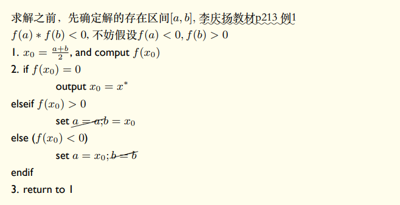
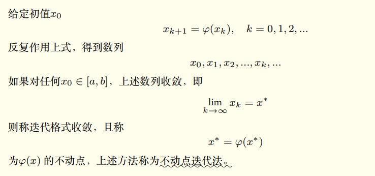
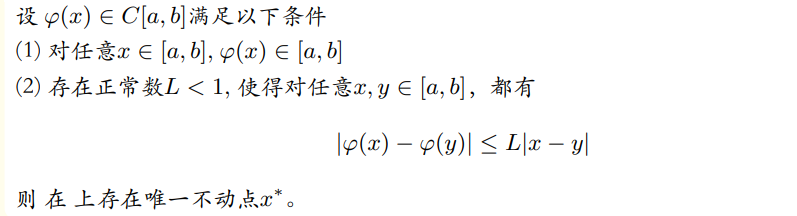
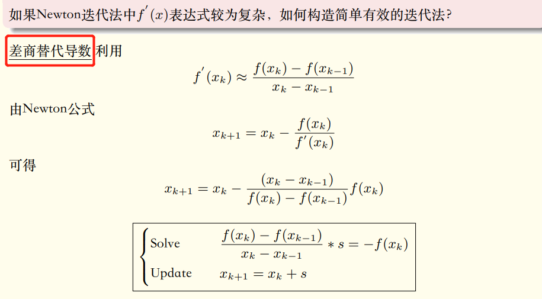
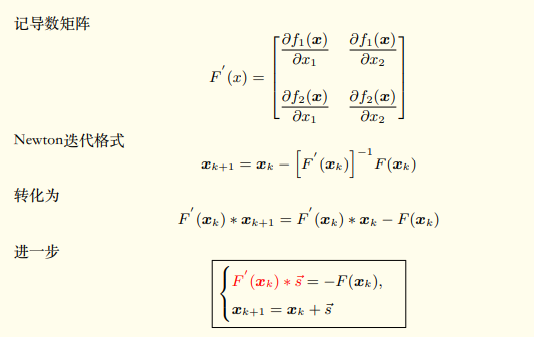
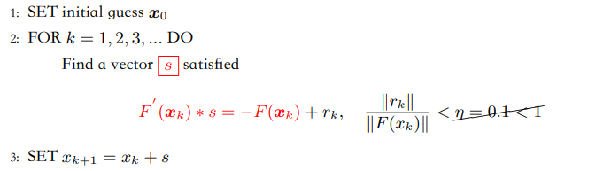

#! https://zhuanlan.zhihu.com/p/582680497
# 非线性方程组数值解

非线性问题是物理模拟中经常出现的一类问题，想要掌握物理模拟避免不了对非线性问题的研究。 
* 从单变量方程求根问题出发，再引入非线性方程组的数值解法。

## 一. 单变量方程求根
已知 $f(x) \in \mathrm{C}_{[a, b]}, f(a) f(b)<0$, 如何求解
$$
f(x)=0\\
$$

**根的搜索：**
如果存在实数 $x^*$ 满足 $f\left(x^*\right)=0$, 则称 $x^*$ 是方程的根, 或者说是函数 $\mathrm{f}(\mathrm{x})$ 的零点. 如果 $\mathrm{f}(\mathrm{x})$ 可以分解成
$$
f(x)=\left(x-x^*\right)^m g(x)
$$
且 $g\left(x^*\right) \neq 0$, 则称 $x^*$ 是 $\mathrm{f}(\mathrm{x})$ 的 $\mathrm{m}$ 重零点, 或方程的 $\mathrm{m}$ 重根.

### 1. 二分法

### 2. 简单迭代：不动点迭代
##### 不动点
将 $\mathrm{f}(\mathrm{x})=0$ 写成等价形式
$$
x=\varphi(x)
$$
若存在 $x^*$ 满足上式, 则称之为 $\varphi(x)$ 的一个不动点。
> * **求 $\mathrm{f}(\mathrm{x}) = 0$ 的零点等价于 求 $\varphi(x)$ 的不动点。**

由等价形式构造迭代格式
$$
x_{k+1}=\varphi\left(x_k\right), \quad k=0,1,2, \ldots\\
$$
$\varphi(x)$ 称为迭代函数。

##### 动点迭代

**收敛条件**
问题: 迭代格式坷时收敛? 回忆线性方程组迭代法的收敛条件!
Theorem 5

* 存在性证明: 构造辅助函数
$$
h(x)=\varphi(x)-x
$$
$h(x)$ 连续, 有 $h(a) \geq 0, \quad h(b) \leq 0$ 介值定理即得结论.

## 二. 非线性方程组
非线性⽅程组⽐单个非线性⽅程或者线性⽅程组要复杂的多； 同时也在实际问题中经常出现，有广泛的应⽤。类似可以考虑n个未知量情形, n 越⼤问题越复杂
### 1. Newton法及其变形方法
#### Newton迭代法

总结：
* (1) 同一个方程可以有不同的迭代格式;
* (2) Newton法收玫速度较快. WHY?
* (3) Newton法局部收玫, 因此对初值要求较高; 可以结合二分法来用。

#### 割线法（弦截法）

**单变量牛顿法算法框架：**
* (1) 割线法超线性收玫: 收敛阶1.618, 好神奇！!
* (2) Newton法有其他变形: Newton下山、简单Newton
* (3) 抛物线法 (Müller ): 收敛阶 $1.84$, 优点是可求复根

##### 病态问题
Newton法或者割线法对于良态问题可以满足精度需求，对于病态问题难以解决！
*  病态就是输⼊数据扰动反应到输出数据上，过分放⼤

>Note: 
>* (1) Newton法和割线法都是采用“以直代曲”思想
>* (2) Muller方法的核心思想: 以抛物线近似曲线

### 2. Newton迭代法解非线性方程组

Newton法的每一步要求解线性方程组, **迭代的每一步系数矩阵$F^{\prime}\left(x_k\right)$ (一般是雅可比矩阵)都在变化**!! 当末知量个数很大时, 求解很困难！!
- 直接法：预先的LU分解没法用、因为每步迭代都是对应新的系数矩阵
- 迭代法: 同样没有统一的预处理, 每步的预处理也随着系数矩阵的不同而改变 

### 3. Inexact Newton method
当末知量个数多了, Newton法实现较为困难。如果特别多 $(n>1$ 百万? ), 可以放弃精确Newton法。

**核心思想: 避免计算 $F^{\prime}\left(x_k\right)$**, 寻找替代品，例如有限差分:
$$
F^{\prime}\left(x_k\right) s=\frac{F\left(x_k+\sigma s\right)-F\left(x_k\right)}{\sigma}\\
$$
本质上是求解线性方程组 $A s=b$, 而许多迭代法如Krylov子 空间法, 求解 $A s=b$ 的过程, 是反复在处理残量 $r_m=b-A s_m$. 假如可以找到 $A s_m$ 的 有效近似, 则可得残量 $r_m$ 的近似。进而求出更新向量 $s$ 的有效近似值。

#### todo...

### 参考资料

1. [【数值分析Newton法及其变形)] ( https://www.bilibili.com/video/BV15Q4y1N72q/?share_source=copy_web&vd_source=e84f3d79efba7dc72e6306f35613222e)
2. [【数值分析非线性方程组Newton法) ] (https://www.bilibili.com/video/BV1A64y1M7Xw/?share_source=copy_web&vd_source=e84f3d79efba7dc72e6306f35613222e)