#! https://zhuanlan.zhihu.com/p/554994259
# 概率论框架
将概率论的知识整理一下形成一个框架， 主要是为了以后遇到针对图形学中的概率知识点可以快速的填入其中。 这个文章将会持续更新。。。

# 一、随机事件与概率
## 事件及事件间运算
### 事件
-   必然事件
-   不可能事件
-   样本空间
-   事件包含与相等
    • A包含于B，类于A属于B符号方向相同
    • A与B相互包含
-   非独立事件
    • 对立事件
    • 互斥事件
    • 互不相容
### 事件运算
-   事件并（和）
-   事件交（积）
-   事件差A-B
-   法则
    • 结合律
    • 分配律
    • 交换律
    • 摩根对偶律
    • 事件对立，和积互换
## 概率，条件概率，独立性，五大概率公式
### 概率公理与概率性质
### 事件独立性
-   事件独立的必要条件公式
    •
    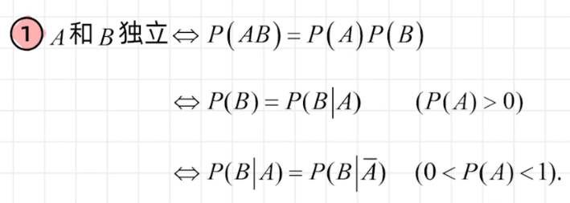
-   独立性质
    • A-B相互独立的充要条件
    •
    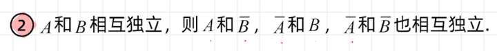
    • 条件消除
    • 相互独立是两两独立的充分不必要条件
    • 三个事件以上
    •
    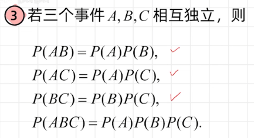
    • 两个事件则充要
    • 独立事件其中部分事件独立
    • 独立事件的对立事件也独立
### 概率五大公式记忆
-   加
    •
    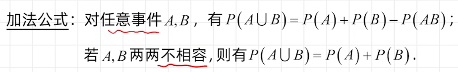
-   减
    •
    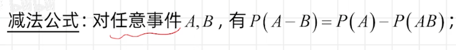
-   乘
    • 条件概率：（A在B发生的条件下发生的概率）
    •
    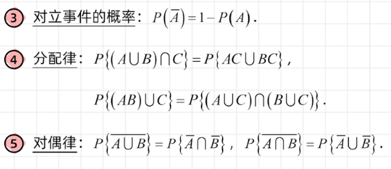
    •
    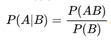
-   全概
    • 完备事件组： 事件全集，包括事件及其互斥
    •
    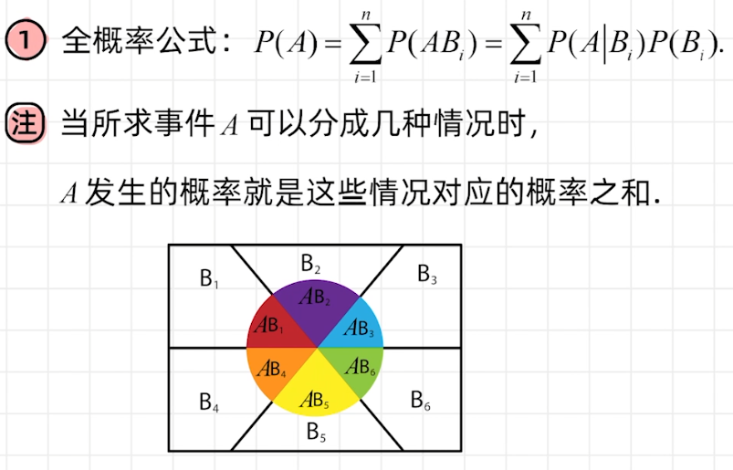
-   贝叶斯
    •
    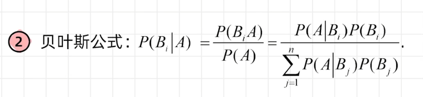
## 古典概型与伯努利概型
### 古典概型
### 几何概型
-   后续分布函数基础
### n重伯努利试验
# 二、随机变量与概率分布
## 随机变量及其分布函数
### 分布函数
-   定义
    •
    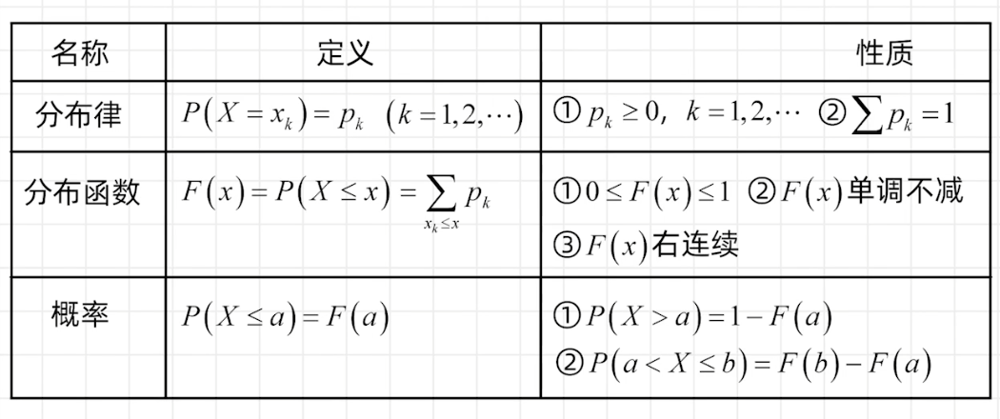
-   性质（5）
    • 函数值域性质
    • 单调非减
    • 右连续
    • P{X\<=x},这个就是右连续
    • 分布函数差，定义域左闭右开
    • 任意一点概率为0上下界相同积分为0
## 离散型与连续性随机变量
### 离散型
-   变量定义
    • 可数多个或者可数无穷多个
-   分布律
    •
-   分布函数
    • 单调非减
### 连续型
-   定义
-   概率密度f（x），非负可积
    • 不一定连续
    • 但连续，一定可积
-   分布函数
    • 一定是R上的连续函数
    • 积分域左闭右开
    • f（x）连续点处分布函数导数等于概率密度函数
## 常用分布
### 离散型
-   几何分布
    • p
-   泊松分布
    • 泊松定理
    • 二项分布的近似公式
    • X～P（入）
-   超几何分布
    • n，N，M
-   二项分布
    • X～B（n，p）
-   0—1分布
### 连续型
-   均匀分布
    • X～U（a，b）
-   正态分布
    • 定义
    • 分布律
    • 一配平方，二除系数三添因子
    • X～N（u，\^2）
    • 分布函数
    •
    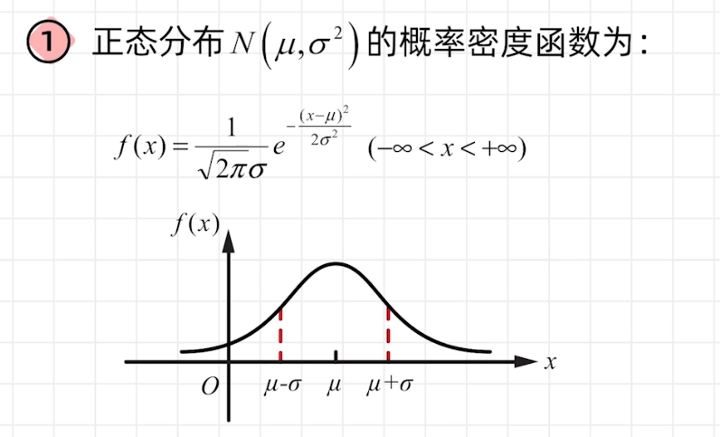
    • 标准正态分布
    • 标准化
    • 凑配
    •
    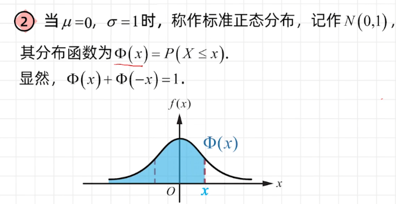
    • 对称性质
    • X～N（0，1）
    •
    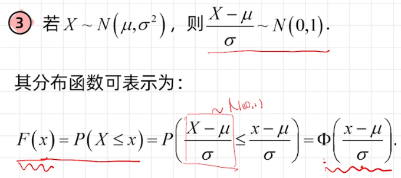
-   指数分布
    • 反常积分
    • 无记忆性
    • X～E（入）
### 方差
-   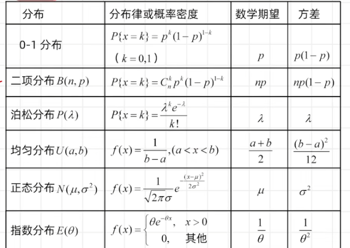
### 概要
-   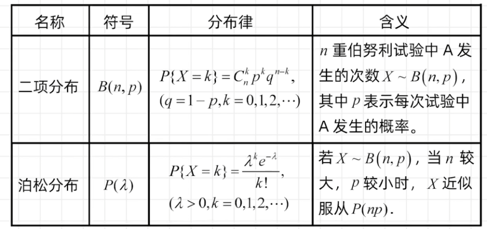
## 随机变量函数的分布
### Y=g（X）
### 离散型
-   表格
### 连续型
-   公式法
-   定义法
    • 重点掌握
    • 确定y的值变化对概率的变化，确定定义域
    • 子主题 2
    • 方法
    • 先求Y分布函数
    • 再求导得分布律或概率密度
# 三、多维随机变量及其分布
## 二维随机变量及其分布
### 二维随机变量
-   转换为平面
### 二维随机变量分布
-   立体空间
-   性质F（x，y）
    • 1. 值0—1
    • 2. 正正极限1，有负极限0
    • 3. x，y单调不减，右连续
    • F（x，y）=P{X\<=x,Y\<=y}
    • 4. P｛a\<X\<=b,c\<Y\<=d｝=F(b,d)-F(b,c)-F(a,d)+F(a,c)，结合二维坐标来记忆
-   离散型
    • 边缘分布律
    • 和y得x
    • 和x得y
    • 条件分布
    • 联合概率分布
    •
    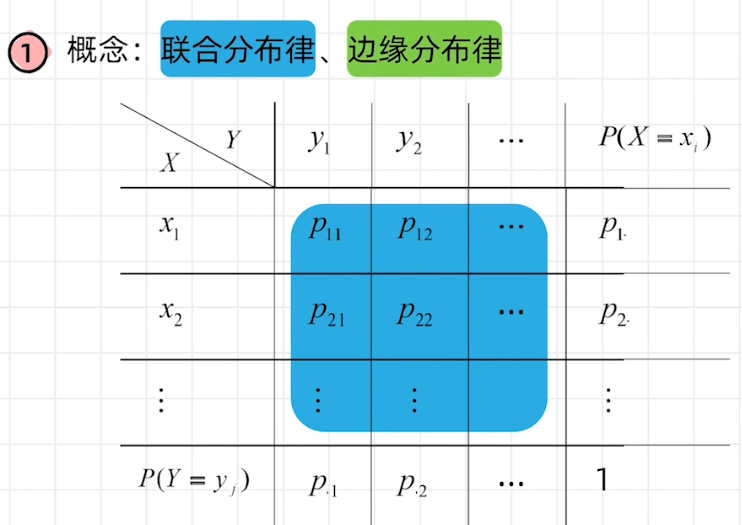
-   连续型
    • 边缘概率密度
    • 条件分布
    •
    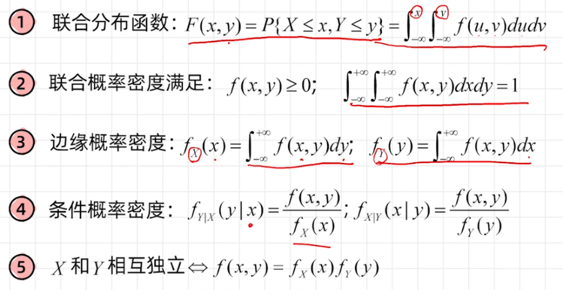
    • 概率（联合）分布
## 随机变量独立性
### 定义
-   F（X，Y）=Fx（x)Fy(y)
### 随机变量相互独立的充要条件
-   边缘分布律，边缘分布密度独立
## 二维均匀分布和二维正态分布
### 均匀分布
-   概率密度
-   重要性质
    • 均匀分布面积倒数为概率密度
    • 部分区域的面积比例即为其概率
### 正态分布
-   服从二维正态分布，则各自服从一维正态分布
-   X，Y相互独立的条件为，相关系数为0
-   （X，Y）服从二维正态分布则，X，Y的线性任意两个线性组合也服从二维正态分布，且线性组合也为服从一维正态分布
-   约定
    • X，Y均服从一维正态，且相互独立，即指（X，Y）服从二维正态分布，相关系数为0
## 两个随机变量函数Z=g（x，y）的分布
### 离散型与一维类同
### X，Y均为连续性随机变量
-   Z的分布函数求法
    • Z=X+Y
    • XY
    • X/Y
-   Z的概率密度求法
    • 不独立时
    • 独立时
    • 卷积公式fx\*fy
# 四、随机变量的数字特征
## 数学期望与方差
### 期望
-   定义
    • 离散
    • 级数x\*p绝对收敛，此级数为x的数学期望或均值
    • 连续
    • 积分xf（x）绝对收敛则，为数学期望
-   性质
    • 1.常数不变
    • 2.数乘提出
    • 3.加减可拆
    • 4.独立拆乘
-   随机变量函数Y=g（X）的期望
    • 积分g（x）f（x）
    • 拆分转换，化成常见分布，代入公式计算
-   Z=g（X，Y）期望
    • 性质
    •
    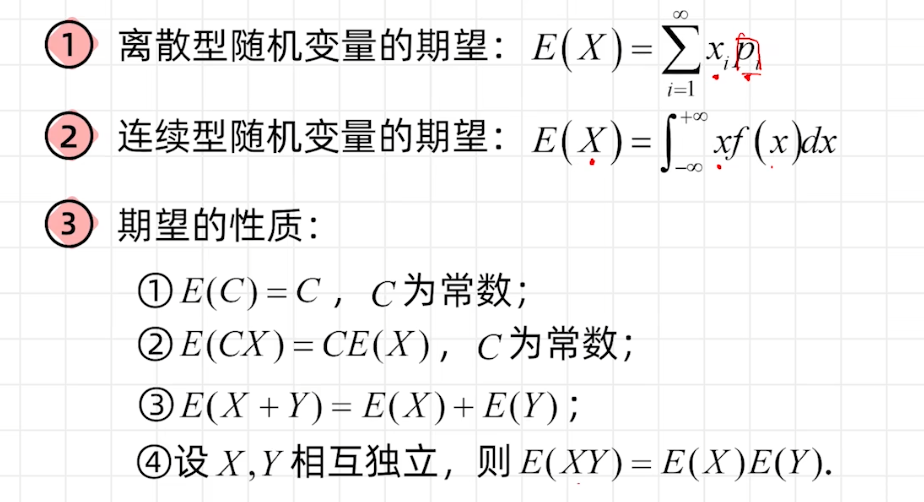
    • 定义
### 方差
-   定义
    •
    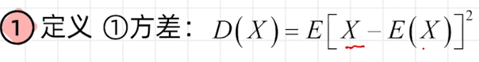
    • 平方的期望 减去 期望的平方
-   性质
    • 1.变量平方的期望大于等于期望的平方2.常数方差为0，而方差为0，随机变量不一定为常数3.D（aX+b）=a\^2D（X）4. 变量独立则，和差拆和
    •
    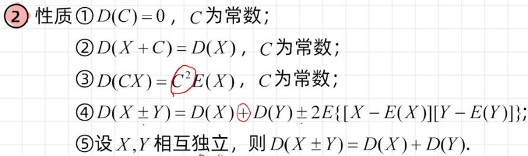
### 常用随机变量期望与方差
-   1\. 0—1分布
-   2\. 二项分布
-   3\. 泊松分布
-   4\. 几何分布
-   5\. 均匀分布
-   6\. 指数分布
-   7\. 正态分布
## 矩，协方差与相关系数
### 矩
-   k阶原点矩
    • 1阶为期望
-   k阶中心矩
    • 二阶为方差
-   X，Y的k阶混合矩
    • 一阶级X，Y均值
-   X，Y的k阶中心混合矩
    • 二阶X，Y的方差
### 协方差
-   定义
    •
    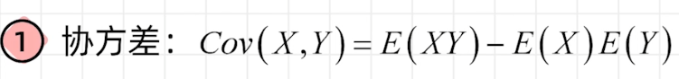
-   性质
    •
    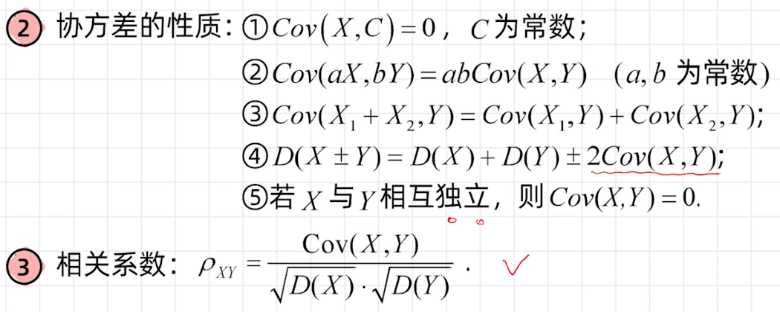
### 相关系数
-   定义
    • 公式
-   性质
    • a\>0., a\<0
    • 系数小于等于1
-   相关，不相关
    • 描述数字特征
-   独立
    • 概率分布
## 切比雪夫不等式
### 事件\|X-EX\|\>=ε的粗略概率估计
### 公式
# 五、大数及中心极限
## 子主题 7
### 依概率收敛
### 切比雪夫不等式
-   概率上限
-   根据切比雪夫不等式有，才有
### 切比雪夫大数
-   独立，期望方差存在，方差有上界
-   依概率收敛于其数学期望
### 列维-林德
-   独立同分布，有期望u与方差
-   随机变量的和近似服从正态分布
    • N（nu，n倍方差）
    • 标准化后，0—1正态分布
### 拉普
-   服从二项分布的变量
-   近似服从标准正态分布
### 辛钦大数
-   独立同分布
-   依概率收敛于期望
## 定义
### 
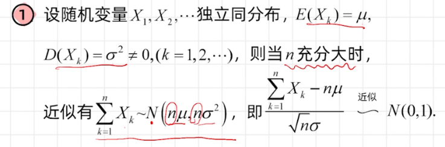
# 六、数理统计
## 总体，样本，统计量，样本数字特征
### 总体
### 样本
-   简单随机样本
-   独立同分布
-   样本所代表的总体
    • 分布F
    • 概率密度f
    • 概率分布P
### 统计量
### 样本数字特征
-   样本均值
    • 等价转换为概率期望
-   样本方差
    • 样本标准差
    • 样本线性相关，样本量为n-1
    • 样本方差的期望为总体的方差
-   样本k阶原点矩
-   样本k阶中心矩
-   性质
### 经验分布
-   样本均值的期望为总体均值
-   样本均值的方差为总体方差的n分之一
## 估计
### 矩估计
**矩估计method of moments思想:** 就是用样本矩估计总体矩。
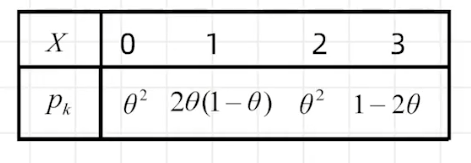
求解步骤：
* (1)写出总体一阶矩 $E(X)=g(\theta)$ ，和样本一阶矩 $\bar{X}=\sum_{i=1}^n (X_i / n)$
* (2)令总体矩 $=$ 样本矩，即 $g(\theta)=\bar{X}$ ，反解出估计量 $\hat{\theta}=h(\bar{X})$
* (3)将 $\bar{X}$ 具体值代入 $\hat{\theta}=h(\bar{X})$ ，得到估计值。

### 极大似然估计
**指导思想**： 已经出现的就是最有可能出现的。(随机抽取的一些数据就是已经出现的数据，这些已经出现的数据组合成的概率就是就是最有可能出现的，即概率最大。)

**离散型总体的最大似然估计步骤：**
设离散型总体 $X$ 的分布律为 $P\{X=x\}=p(x, \theta)$ ，其中 $\theta$ 为末知参数， 设 $x_1, x_2, \cdots, x_n$ 是一组样本观测值.
* 计算似然函数 $L(\theta)=\prod_{i=1}^n p\left(x_i, \theta\right)$;
* 对似然函数取对数得到 $\ln L(\theta)=\sum_{i=1}^n \ln p\left(x_i, \theta\right)$ ；
* 令 $\frac{d}{d \theta} \ln L(\theta)=0$ ，解出最大似然估计 $\hat{\theta}$.

**连实型总体的最大似然估计步骤：**
设连续型总体 $X$ 的概率密度为 $f(x, \theta)$ ，其中 $\theta$ 为末知参数， 设 $x_1, x_2, \cdots, x_n$ 是一组样本观测值.
* 计算似然函数 $L(\theta)=\prod_{i=1}^n f\left(x_i, \theta\right)$
*  对似然函数取对数得到 $\ln L(\theta)=\sum_{i=1}^n \ln f\left(x_i, \theta\right)$ ；
* 令 $\frac{d}{d \theta} \ln L(\theta)=0$ ，解出最大似然估计 $\hat{\theta}$.

>Note: [指数分布族等等可以保证似然函数是global strictly concave的问题，Critical Points（导数为0的点）一定是唯一极大值点（于是是最大值点）](https://www.zhihu.com/question/263423642)

### 无偏估计
**无偏估计**：
如果 $E(\hat{\theta})=\theta$ ，则称 $\hat{\theta}$ 为 $\theta$ 的无偏估计量。
-   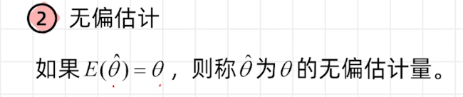
### 估计量计算
-   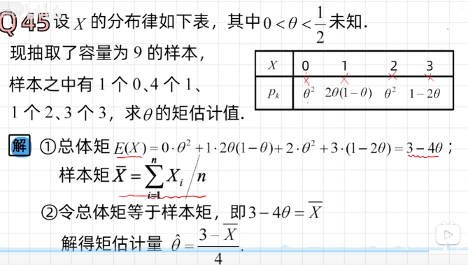
## 常用统计分布与正态总体的抽样分布
### 卡方分布
-   独立同分布的标准正态随机变量的平方之和
-   性质
### t分布
-   定义
-   性质
### F分布
-   定义
-   性质
### 性质
-   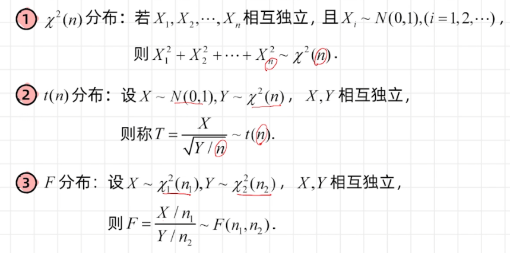

### 参考资料
1. [《概率统计》](https://www.bilibili.com/video/BV1TJ411y7Zp/?spm_id_from=333.788.recommend_more_video.1&vd_source=1a163e481fb12c5b6ca8a57f994c1d73)