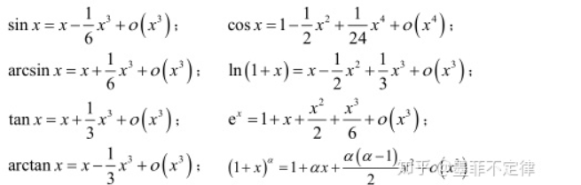
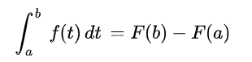
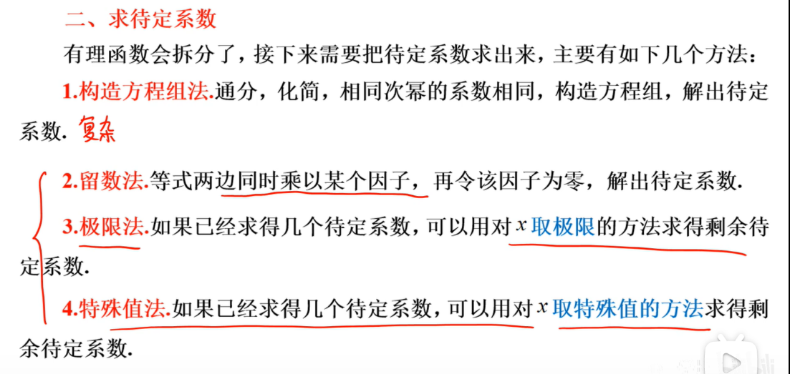
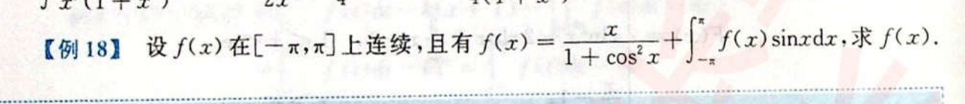
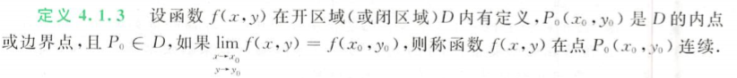
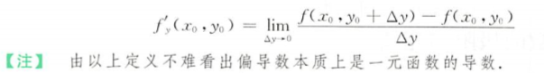
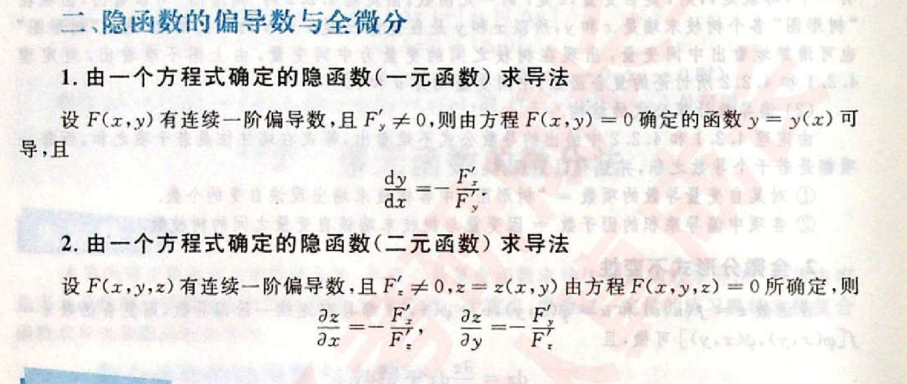
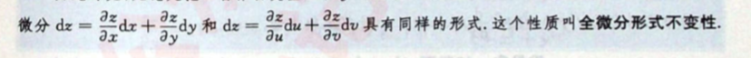
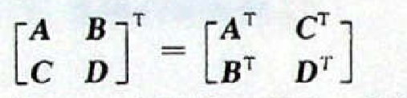
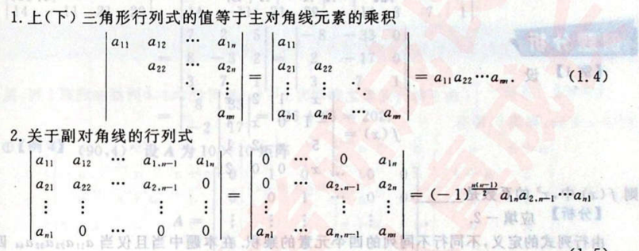

# 高等数学

以直代曲， 线性逼近， 以平代曲， 切平面

哲学思索

时空问题：

时间和空间是否可以无限细分?

芝诺悖论

飞矢不动理论

# 极限和函数连续性

## 极限的定义

### 极限是函数或数列在去心领域内无限逼近的某个值

### 白话解释： 无论离某个值（极限值）有多近e，在去心领域内存在x使得距离更近

## 极限

### 重要关系

-   极限存在的充要条件： 左右极限存在且相等且=常量
-   数列极限存在的充要条件：
-   存在极限和无穷小的关系
-   保号性
-   无穷大和无穷小的关系

### 判别极限存在的两个重要法则

-   1\. 夹逼定理
-   2\. 单调有界定理

### 几个重要极限和等价无穷小

### 极限计算的方法

-   1\. 极限的运算法则

    • p-17-例题4

    •

    

-   2\. 等价无穷小替换与等价去穷小的充要条件 （无穷小替换也有可能需要多层替换）

    • 乘除可以用无穷小近似+ 加减不能随意用

    • 无穷小替换失效的根本原因是丢掉了高阶导数的近似的信息

-   3\. 洛必达法则 （存在时同时存在， 无穷大时同时无穷大）

    •

    

-   4\. 皮亚诺余项的泰勒公式

    •

    

    • 阿珂她太浪 （ln 是连续且没有阶乘）

-   5\. 利用积分和式计算
-   6\. 无穷大转化成无穷小（ 通过通分处理， 倒代换）

    

    • p14-例题1

-   7\. 将幂指函数 转化为指数函数处理

    

    • p-15-例题2

-   8\. 利用单调函数来求
-   9\. 拉格朗日

    •

    

## 无穷小问题 （正负无穷大也不是一个具体的数）

### 无穷小不是数， 数列无穷小，是指由多个数列都是无穷小，而不是只有一个。

### 无穷小量家族：

-   a. 有唯一的实数 0
-   b. 收敛到0的数列
-   c. 极限值为0 的函数

## 连续性和间断点

### 第一类间断点（左右极限都存在）: a. 可取间断点 b.跳跃

### 第二类间断点 : a.无穷 b. 震荡

### 备注： 在某点可导和在某点邻域可导不是同一个概念

### 关键要要找到 可疑点 （很容易找漏了）

## 极限和连续关系

### 连续的定义

-   

    

### 

## 某点x0 可导 （或连续） 并不能推出该点在其邻域内连续

## 函数性质

### 极值

-   a。 找f(x) 一阶导 = 0 和 不存在的点 ； b。 判断f(x) 一阶导在左右两侧是否异号

### 拐点

-   a。 找f(x) 二阶导 = 0 和 不存在的点 ； b。 判断f(x) 二阶导在左右两侧是否异号

### 例题

-   

    

## 函数性质：一切初等函数在其定义区间内都是连续 （定义区间，就是指在定义域内的区间）

### 最小值和最大值

### 零点定理和介值定理

## 极限和无穷小的关系

# 导数与微分

## 微积分定理

### 第一定理：（面积的导数就是曲线，曲线的原函数就是面积）

-   

    

### 第二定理： 关于原函数和积分的关系。

-   

    

## 导数定义：

### 增量Dy与自变量Dx的极限

### f(x) 在一点可导和在邻域可导的区别

## 求导法则

### 注意定义域

### 复合函数求导法则: 链式法则

### 隐函数求导， 参数方程求导

## 导数与微分关系 :

### 微分是自变量产生微小变化时，计算因变量的近似值 ：

### 是指函数在某一点处（趋近于无穷小）的变化量，是一种变化的量

-   

    

## 导数公式

### 

## 函数可导性与连续的关系:

### 

## 讲定义和怎么求

# 微分中值定理

## 有什么用？

### 为连续服务

### 中值定理是导数应用的理论基础

### 建立了导数和函数的联系

## 中值定理

### 1. 费马定理

-   

    

### 2. 罗尔中值定理是拉格朗日中值定理的特例， 拉格朗日是柯西中值定理的特例

-   前提： 函数闭区间连续开区间可导

    

-   利用曲线函数 - 直线函数， 辅助函数证明

    •

    

### 3. 柯西中值定理：

-   闭区间连续开区间可导且f(x)\` 不等于0
-   

    

### 4. 泰勒定理

-   也就是具有拉格朗日余项的泰勒公式

## 二重积分中值定理

### 定义

-   

    

    • 子主题 1

### 第一积分中值定理

-   

    

### 求极限

## 辅助函数构造方法

### 微分方程法

-   

    

## 重要方法

### 1. 不等式的证明

-   用单调性证明
-   用最值证明
-   用中值定理

### 2. 零点问题存在性的证明方法

## 洛必达法则 ：首先条件就是导数都存在， 解决0-0型或者无穷-无穷型

### 证明链接

## 泰勒公式 ： 就是用多项式去逼近光滑函数， 在某点出不断的求高阶导逼近模拟原函数

### 

### 

## 函数性质

### 函数牢记定义域

### 单调性 与曲线的凹凸性

### 最值问题

### 应用问题 ： 曲率

-   弧微分

    •

    

-   曲率及其计算公式
-   渐曲线与渐伸线

# 不定积分和定积分

## 原函数存在性:

### 什么时候存在？ ： 连续函数一定有原函数， 一定存在原函数。

### 原函数存在和 可积 没有必然联系 （即两者不能相互推出）

### 

### 原函数性质

-   

    

### 可积性质 （必须的在闭区间内）

-   

    

### 积分上限函数什么时候可导：

-   

    

-   可推： 区间含有跳跃间断点 和无穷间断点不可导，

### 原函数的一般表达式F(x) + C 称为f(x) 的不定积分： 不定积分 = 变上限积分 + C

### 不连续但是存在原函数 f(x) = sin(1/x) 但是黎曼可积（在0到1区间内）

## 反常积分 （开区间）

### 概念理解 （牢记收敛的条件）

-   

    

-   

    

    •

    

### 接替过程

-   

    

### 反常积分审敛法

-   

    

-   

    

## 理论部分

### 如何判断积分积不出来

-   

    

## 变上限积分

### 用换元积分法

-   

    

### 奇偶性， 周期性

-   

    

-   

    

## 不定积分

### 积分公式

-   

    

-   

    

### 第一类换元法（凑微分）

-   同除， 凑微分（也可以认为是第一类换元法）

### 第二类换元法

-   三角函数积分 —— 可以采用万能公式
-   如果根式里面大于1用三角换元， 如果根式小于等于1根式换元

### 有理化函数积分

-   1\. 将被积函数拆分， 成若干项简单真分式相加

    •

    

-   2\. 有理拆分方法待定系数法

    •

    

-   3\. 倒代换

    •

    

    •

    

### 三角函数有理式的积分

-   1\. 化成同角
-   2\. 尽量约分 ，降阶
-   3\. 分母化成单项式
-   4\. 利用 1 = sinx\^2 + cosx\^2

### 组合积分 —— 需要观察，利用对称性（技巧性强）

### 分部积分

-   表格法

    •

    

-   被积函数 有可导 （幂函数可导成0）可积
-   被积函数有反三角函数 和 幂函数 最终可以有理化
-   指数函数和 三角函数 回到自身

    •

-   分母为平方的分部积分

    •

    

    •

    

## 定积分计算

### 区间再现 拆分积分上下限 ， 然后再组合成新的被积函数 f(x)

-   

    

### 利用原函数F(x)的值凑出 f(x)的积分 ———— 技巧性很强（一般是定积分中使用）

-   

    

### 根据积分上下限来利用诱导公式（即 第一类换元积分法， 利用周期性再变回自身）

-   

    

### 如果有极限需要化成定义来求解

## 多元函数微积分学

### 相互关系图

-   

    

    • 偏导连续是指两个偏导都连续

-   多元函数的可导既不能推得连续也不能推的可微， 多元的可导是指一阶偏导数存在, 偏导数是用一元函数极限定义的。而多元函数的连续和可微都是用重极限定义的

    

-   二元函数可微为什么不能推出偏导连续，而偏导连续却能推出可微?
-   偏导数连续必可微 （马同学）

    

### 1. 二元函数的极限与连续

-   重极限的概念

    • 参考一元函数极限

-   二元函数连续的概念

    •

    

-   连续函数的性质

    • 连续函数 和差积商 都为连续 其复合函数也为连续函数

    • 最大值和最小值定理

    • 介值定理

### 2. 求二重极限

-   利用极限的性质 （夹逼准则）
-   消去分母中极限为0 的因子 （通常采用有理化，等价无穷小代换）
-   转化为一元函数极限， 利用一元函数求极限的方法来来求解

### 3. 偏导数与全微分

-   偏导数概念

    •

    

    • 注意偏导数和偏导函数的区别， 有时候在没有歧义的情况下， 称呼偏导函数为偏导数

    

-   偏导数几何意义 ： 偏导数就是平行于坐标轴的斜率
-   全微分的概念： 全微分就是切平面（二元函数）

    •

    

-   隐函数的确定的偏导数和全微分 （利用隐函数存在定理）

    •

    

### 4. 多元函数微分法

-   复合函数求导法则: 记住树形图

    •

    

-   全微分形式不变性 （全微分法）

    •

    

    •

    

-   高阶偏导数和混合偏导数与求导次序无关
-   隐函数求导

### 5. 极值

-   拉格朗日乘数法求极值

    •

    

-   本质： 就是找出满足限定条件时候的共线的梯度值
-   梯度就是等值线的法线

    •

    

### 二重积分

-   定义： 极限来定义的
-   分割、近似、求和、取极限
-   性质： 基本就是中值定理那一套
-   最总计算 ： 二重积分化为累次积分计算

    

-   方法总结

    • 1. 利用积分顺序

    • 2. 利用积分区域本身具有对称性， 被积函数的奇偶性

    • 3. 对积分区域分割成 具有对称特征的子区域

    • 4. 极坐标转换

    • 5. 将被积函数进行切分

## 雅克比行列式

### 笛卡尔坐标和极坐标的积分转换

## 应用部分

### 一重积分应用

-   计算旋转体

    •

    

-   形心， 质心（重心）

    •

    

    •

    

    • 加上某个方向的权重

-   摆线

    •

    

-   长度和面积

    •

    

    •

    

### 二重积分应用

-   对称性和轮换对称性

    •

    

    •

    

# 微分方程

## 重难点： 关键在于理解线性变换

### 1. 输入一个向量 输出一个向量的特殊函数

### 2. 微分方程的求导算子 相当于对原方程做了 一次线性变换

### 3. 微分算子：

-   

    

## 指数函数是求导算子的特征函数

### 

## 线性变换具有的性质：(注意齐次必须一次齐次)

### 

### 线性微分方程解的结构

-   为什么长这样？
-   理解特解和通解

## 齐次方程形式 :

### 

### 齐次 含义

-   本质上说， “次”代表函数中每一个独立项的指数， “齐”是指一样。 ”齐次“ 即表示函数每一个独立项的指数是相等的。

    

### 

## 线性方程

### 齐次线性方程：

-   

    

### 非齐次

-   

    

## 二阶常系数线性微分方程

### 齐次通解的结构

-   

    

    •

    

### 非齐次特解结构

-   

    

    • k 按照 （lamda ） 是否是特征方程的单根， 重根 或不是根， 依次取为 1， 2 ， 0

-   

    

    • K 按 （lamda + wi）是不是特征方程的根 取 0 或者 1

## 应用拓展

### 欧拉公式

### 偏导数全微分 与 微分方程结合

-   

    

### 反函数与 原函数的微分关系

-   

    

## 概要： 线性方程大概是说微分方程的解做线性组合后还是原方程的解。而齐次方程是说： 构成这个方程的函数具有齐次性。

### 对于n阶线性微分方程，齐次的考量不再是g(x,y)，而变成了g(y）

# 线性代数

## 矩阵

### 矩阵等价： 经过有限次的初等变换之后相等

### 矩阵初等变换： 倍乘， 倍加， 互换

### 线性变换

-   1\. 变换前是直线的，变换后依然是直线
-   2\. 直线比例保持不变
-   3\. 变换前是原点， 变换后依然是原点
-   仿射变换

    • 线性变换 + 平移

### 矩阵的本质： 是运动的描述

-   旋转： 旋转矩阵
-   拉伸(包括缩放) ： 对称矩阵
-   可以记录变换

### 矩阵运算法则

-   不满足交换律

### 矩阵的秩

-   

    

### 分块矩阵

-   运算法则

    • 转置

    •

    

    • 逆矩阵 和 n阶乘

    •

    

### 伴随矩阵的关系

-   

    

-   

    

### 伴随矩阵存在的意义就是给逆矩阵架梯子

## 行列式

### 本质含义

-   行列式是线性变换的伸缩因子

    

### 5大性质

-   1\. A转置 = A
-   2\. 两行（列) 互换位置， 行列式的值变号
-   3\. 某一行（列） 有公因子 K， 可将k提出行列式外
-   4\. 将一行 拆成 两个行列式之和

    •

    

-   5。 行列倍加 值不变

### 行列式重要公式

-   1\. 三角形行列式 === 主副对角线

    •

    

-   2\. 拉普拉斯展开

    •

    

-   3\. 范德蒙行列式
-   4\. 代数余子式的补充

    •

    

-   5\. 抽象n阶行列式公式

    •

    

-   6\. A的n阶乘矩阵的计算

### 应用计算

-   经典例题

    •

    

    •

    

-   1\. 一弹一星 和两弹一星

    •

    

-   2\. 爪型

    •

    

-   3\. 异爪型

    •

    

-   4\. 行（列） 和相等型

    •

    

-   5\. 行（列）同数型 ==\> 加边法

    •

    

-   6\. 三对角线型

    •

    

-   7\. 回字型 （采用拉普拉斯展开式）

    •

    

### 抽象型行列式计算

-   1\. 利用行列式性质 展开求解
-   2.利用 \| AB \| = \|A\| \* \|B\|
-   

    

### 代数余子式求和

-   

    

## 杂项

### 二项式定理

-   

    

### 判断是否可逆

-   1\. 判断矩阵是否满秩
-   2\. 看看是否可以找到 矩阵 X 矩阵 = E

### 求逆矩阵

-   

    

## 向量

### 线性无关

-   

    

    •

    

### 初等变换 ： 倍乘 ， 倍加，互换

### 秩

-   秩 ： 矩阵的维度， 矩阵基的数量
-   秩的不等式

    •

    

    •

    

    •

    

    •

    

    • 也可以由极大无关组来证明

### 正交矩阵

-   

    

-   正交矩阵的列向量必是单位向量， 而且任意列向量要两两正交

    

-   施密特正交化

    •

    

### 线性方程组

-   1\. 基础解系 + 行（列）向量与解向量的关系 （由已知解求新的组合解）

    •

    

-   2\. 求方程组公共解系

    •

    

-   3\. 同解方程组： 方程组A的解必满足方程组B， 方程组B必满足方程组A

## 特征值， 特征向量， 相似矩阵

### 特征值 + 特征向量关系

-   关系 ： 运动的速率 + 运动的方向
-   矩阵的迹： r1+ r2 + ....+ rn = 迹 = 矩阵主对角线之和

    •

    

### 抽象特征值特征向量计算

-   

    

### 相似矩阵： 同一变换在不同矩阵下的不同描述。 （即时同一个运动）

### 相似矩阵可对角化的条件

-   1\. A 有n个线性无关的特征向量

    • 特征值不相等 =\> 特征向量线性无关

    • 特征方程的重根 等于 该根 特征向量数

-   2\. 实对称阵必可相似对角化

    •

    

-   必要条件

    •

    

### 应用实例

-   奇异值分解：

    • 找到一组两两正交的单位向量序列， 使得矩阵作用在该向量序列后得到新的向量序列依旧保持两两正交

-   相似判断

    •

    

    • 特征矩阵等价

    • 必要条件

    

## 二次型

### 矩阵合同性质

-   

    

    •

    

-   两个矩阵合同， 其中一个对称则另外一个必然对称

### 什么是合同关系

-   

    

### 合同的矩阵是同一个双线性形在不同基下的矩阵。

## 应用问题

### 双线性型：

-   

    

-   双线性型就是任何情况下， 固定一个变量， F(a, b)是 另一个变量的线性函数

### 矩阵合同： 同一个双线性运算在不同坐标系下的表示。

### 二次型 ： 二次齐次函数

## 向量可以组成矩阵， 而矩阵既可以看成变换， 也可以看成基

### 总结：

-   空间可以容纳运动对象， 一种空间对应一类对象
-   线性空间是容纳向量对象运动的。
-   变换是一种瞬时不连续的运动
-   运动是相对的： 矩阵既可以描述坐标系也可以描述运动
-   矩阵的相似和矩阵的合同都是由线性空间中坐标系的转换引起的

# 化行最简阶梯型矩阵技巧

## 1. 找出首行非0的且含0项最多的行作为第一行

## 2. 利用第一行乘k倍加到下面的行将除了第一行以外的其他行的首行数化为0

## 3. 不看第一行， 在其余行第二列中选择一个与尽量多数有倍数关系的数作为第二行， 再利用上述操作将第二行第二列以外的数化为0

## 4. 以此类推

## 关键就是讲首列数化为0

# 参考资料

## 《神奇的矩阵》

## 胡翠芳老师的《线性代数的几何意义》
